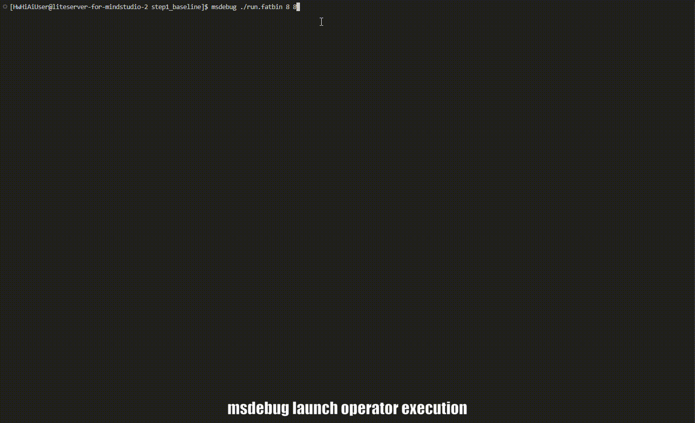

<h1 align="center">MindStudio Debugger</h1>

<h2>MindStudio Debugger for Ascend AI Operators</h2>
  
  
 

## ✨ Latest Updates

🔹 **[2025.12.31]**: MindStudio Debugger is fully open-sourced.

## ️ ℹ️ Overview

MindStudio Debugger (msDebug) is an operator debugging tool built on the LLVM compiler infrastructure for Ascend devices. It is used to debug operator programs running on the NPU and provides developers with key debugging capabilities, including reading the memory and registers of Ascend devices, and pausing and resuming the program execution.

  <h4>▶️ Quick demo</h4>
  
  
Figure: Demonstrates operations such as setting breakpoints for board debugging, printing variables, and step-by-step debugging of operators.

## ⚙️ Functions

msDebug can debug all Ascend operators, including Ascend C operators (Vector, Cube, and Mix fused operators). You can select the operators as required. The following functions are supported:

|Function|Description|
|:------|:---------|
|**Breakpoint setting**|You can set a line breakpoint on the running program of an operator, that is, set a breakpoint on a specific line in the operator code file.|
|**Variable and memory printing**|Based on the variable type and usage, a variable can be stored in a register or in the local memory or global memory. You can print the address of a variable to find its storage location and further print the associated memory.|
|**Step-by-step debugging**|You can perform step-by-step debugging to learn about the code execution details.|
|**Running interrupting**|When the operator execution program freezes, manually interrupt the operator execution program and display the interrupted location information.|
|**Core switching**|Switch the current core to the specified core. After the core is switched, the position of the code interruption of the specified core is automatically displayed.|
|**Program status checking**|After an operator is called, you can read the register values of the device where the current breakpoint is located to check the program status.|
|**Debugging information displaying**|Query information about the device where the operator runs.|
|**Core dump file parsing**|By parsing the dump files of abnormal operators, you can collect sufficient data for problem analysis even without a stress test.|

## 🚀 Quick Start

For details, see [msDebug Quick Start](docs/en/quick_start/msdebug_quick_start.md).

## 📦 Installation Guide

For details about the environment dependencies and installation methods of the tool, see [msDebug Installation Guide](docs/en/install_guide/msdebug_install_guide.md).

## 📘 User Guide

For details about how to use the tool, see [msDebug User Guide](docs/en/user_guide/msdebug_user_guide.md).

## 💡 Typical Cases

For details about how to use the tool in typical scenarios, see [msDebug Typical Cases](docs/en/best_practices/basic_cases.md).

## ❓ FAQs

For details about frequently asked questions and solutions, see [msDebug FAQs](docs/en/support/faq.md).

## 🛠️ Contribution Guide

You are welcome to contribute to the project. For details, see [Contribution Guide](./docs/en/contributing/contributing_guide.md). 

## ⚖️ Related Information

🔹 [Release Notes](./docs/en/release_notes/release_notes.md)  
🔹 [License Notice](./docs/en/legal/license_notice.md)  
🔹 [Security Statement](./docs/en/legal/security_statement.md)  
🔹 [Disclaimer](./docs/en/legal/disclaimer.md) 

## 🤝 Suggestions and Communication

You are welcome to contribute to the community. If you have any questions or suggestions, please submit an [issue](https://gitcode.com/Ascend/msdebug/issues). We will reply as soon as possible. Thank you for your support.

|                                      📱 Follow the MindStudio WeChat Account                                      | 💬 More Communication and Support                                                                                                                                                                                                                                                                                                                                                                                                                    |
|:-----------------------------------------------------------------------------------------------:|:-------------------------------------------------------------------------------------------------------------------------------------------------------------------------------------------------------------------------------------------------------------------------------------------------------------------------------------------------------------------------------------------------------------------------------|
|  *Scan the QR code to follow us and get the latest updates.*| 💡 **Join the WeChat group**: Follow the WeChat account and reply "communication group" to obtain the QR code for joining the group.  🛠️ ️**Other channels**:  |

## 🙏 Acknowledgements

This tool is jointly developed by the following Huawei departments:  
🔹 Ascend Computing MindStudio Development Department  
🔹 Ascend Computing Ecosystem Enablement Department  
🔹 Huawei Cloud AI Compute Service  
🔹 Compiler Technologies Lab, 2012 Labs  
🔹 Markov Lab, 2012 Labs  
Thank you to everyone in the community for your PRs. We warmly welcome your contributions.
