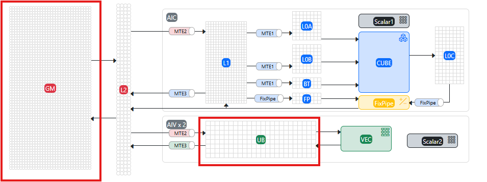

# **Typical Cases**

## Debugging a Vector Operator on the Board

**Overview**

This section demonstrates how to use the `msdebug` tool to debug a Vector operator on the board. The Vector operator adds two vectors and outputs the result.

**Preparation**

- Click [link](https://gitcode.com/Ascend/mstt/tree/master/sample) to obtain the sample project and prepare for operator debugging.
- Complete the environment variable configuration as described in the [MindStudio Debugger User Guide](../user_guide/msdebug_user_guide.md).

**Procedure**

1. Compile the operator based on the sample project to obtain the executable file `add.fatbin`.
   1. Modify the `COMPILER_FLAG` compilation option in `sample/normal_sample/vec_only/Makefile`. Change `-O2` to `-O0 -g --cce-ignore-always-inline=true` to enable compiler debugging.

      ```bash
      # Makefile
      ...
      COMPILER            := $(ASCEND_HOME_PATH)/compiler/ccec_compiler/bin/ccec
      COMPILER_FLAG       := -xcce -O0 -g --cce-ignore-always-inline=true -std=c++17 # Enable compiler debugging
      ```

   2. Run the following command to compile the operator.

      > [!NOTE]
      > For non‑first‑time scenarios, you can use `make clean && make` instead of `make`.

      ```bash
      cd ./mstt/sample/normal_sample/vec_only/
      make clean && make
      ```

2. Set breakpoints.
   1. Start the `msdebug` tool to launch the operator program and enter the debugging interface.

      ```bash
      msdebug add.fatbin  
      (msdebug) target create "add.fatbin"
      Current executable set to '/home/mindstudio/projects/mstt/sample/build/add.fatbin' (aarch64).
      (msdebug) 
      ```

   2. The kernel function code for this sample is located in `add_kernel.cpp`. In this file, set an NPU breakpoint at the desired line.

      ```bash
      (msdebug) b add_kernel.cpp:69
      Breakpoint 1: where = device_debugdata`::add_custom(uint8_t *, uint8_t *, uint8_t *) + 18804 [inlined] 
      KernelAdd::Compute(int) + 5144 at add_kernel.cpp:69:9, address = 0x0000000000004974
      (msdebug) 
      ```

3. Run the operator program.

   The program runs until it hits the first breakpoint (`add_kernel.cpp:69`) and stops. `msdebug` detects that the NPU kernel function `add_custom` starts running on Device 0.

   ```cpp
   (msdebug) run
   Process 730254 launched
   [Launch of Kernel add_custom on Device 0]
   Process 730254 stopped
   [Switching to focus on Kernel add_custom, CoreId 13, Type aiv]
   * thread #1, name = 'add.fatbin', stop reason = breakpoint 2.1
       frame #0: 0x0000000000004974 device_debugdata`::add_custom(uint8_t *, uint8_t *, uint8_t *) [inlined] KernelAdd::Compute(this=0x000000000019a930, progress=0) at add_kernel.cpp:69:9
      66              // call Add instr for computation
      67              Add(zLocal, xLocal, yLocal, TILE_LENGTH);
      68              // enque the output tensor to VECOUT queue
   -> 69              outQueueZ.EnQue<int16_t>(zLocal);  # Breakpoint location
      70              // free input tensors for reuse
      71              inQueueX.FreeTensor(xLocal);
      72              inQueueY.FreeTensor(yLocal);
   (msdebug)
   ```

4. Inspect information.
   - Use the `ascend info cores` command to query NPU core information.

      ```bash
      (msdebug) ascend info cores 
        CoreId  Type  Device Stream Task Block         PC               Exception
      *  13     aiv      0     3     0     0     0x1240c0034974         f0000000
         14     aiv      0     3     0     1     0x1240c0034974         f0000000
         15     aiv      0     3     0     2     0x1240c0034974         f0000000
         20     aiv      0     3     0     3     0x1240c0034974         f0000000
         21     aiv      0     3     0     4     0x1240c0034974         f0000000
         22     aiv      0     3     0     5     0x1240c0034974         f0000000
         23     aiv      0     3     0     6     0x1240c0034974         f0000000
         24     aiv      0     3     0     7     0x1240c0034974         f0000000
      (msdebug)
      ```

   - Use the `print` command to directly print variable information.

      ```bash
      (msdebug) print progress 
      (int32_t) $0 = 0
      ```

   - Use the `print` command together with the `memory read` command to print the values stored in Tensor variables.
      - Print data stored in a `LocalTensor` located in UB memory.

         > [!NOTE]
         > The starting address for UB memory printing must refer to the `bufferAddr` parameter in the `address_` field of the `LocalTensor` variable. Here we use variable `xLocal` as an example; its memory start address is `0`.

         ```bash
         (msdebug) print xLocal
         (AscendC::LocalTensor<short>) $0 = {
           address_ = (dataLen = 256, bufferAddr = 0, bufferHandle = "", logicPos = '\t')
           shapeInfo_ = {
             shapeDim = '\0'
             originalShapeDim = '\0'
             shape = ([0] = 0, [1] = 0, [2] = 0, [3] = 0, [4] = 0, [5] = 0, [6] = 0, [7] = 0)
             originalShape = ([0] = 0, [1] = 0, [2] = 0, [3] = 0, [4] = 0, [5] = 0, [6] = 0, [7] = 0)
             dataFormat = ND
           }
         }
         (msdebug) memory read -m UB -f int16_t[] 0 -s 256 -c 1
         0x00000000: {0 1 2 3 4 5 6 7 8 9 10 11 12 13 14 15 16 17 18 19 20 21 22 23 24 25 26 27 28 29 30 31 32 33 34 35 36 37 38 39 40 41 42 43 44 45 46 47 48 49 50 51 52 53 54 55 56 57 58 59 60 61 62 63 64 65 66 67 68 69 70 71 72 73 74 75 76 77 78 79 80 81 82 83 84 85 86 87 88 89 90 91 92 93 94 95 96 97 98 99 100 101 102 103 104 105 106 107 108 109 110 111 112 113 114 115 116 117 118 119 120 121 122 123 124 125 126 127}
         (msdebug) 
         ```

      - Print data stored in a `GlobalTensor` located in GM memory.

         > [!NOTE]
         > The starting address for GM memory printing must refer to the `address_` field of the `GlobalTensor` variable. Here we use variable `xGm` as an example; its memory start address is `0x00001240c0015000`.

         ```bash
         (msdebug) print xGm
         (AscendC::GlobalTensor<short>) $0 = {
           bufferSize_ = 2048
           shapeInfo_ = {
             shapeDim = '\0'
             originalShapeDim = '\0'
             shape = ([0] = 0, [1] = 0, [2] = 0, [3] = 0, [4] = 0, [5] = 0, [6] = 0, [7] = 0)
             originalShape = ([0] = 0, [1] = 0, [2] = 0, [3] = 0, [4] = 0, [5] = 0, [6] = 0, [7] = 0)
             dataFormat = ND
           }
           address_ = 0x00001240c0015000
         }
         (msdebug) memory read -m GM -f int16_t[] 0x00001240c0015000 -s 256 -c 1
         0x1240c0015000: {0 1 2 3 4 5 6 7 8 9 10 11 12 13 14 15 16 17 18 19 20 21 22 23 24 25 26 27 28 29 30 31 32 33 34 35 36 37 38 39 40 41 42 43 44 45 46 47 48 49 50 51 52 53 54 55 56 57 58 59 60 61 62 63 64 65 66 67 68 69 70 71 72 73 74 75 76 77 78 79 80 81 82 83 84 85 86 87 88 89 90 91 92 93 94 95 96 97 98 99 100 101 102 103 104 105 106 107 108 109 110 111 112 113 114 115 116 117 118 119 120 121 122 123 124 125 126 127}
         ```

   - Switch cores to another aiv core and print the required information.

      ```cpp
      (msdebug) ascend aiv 24  // In ascend info cores, select the coreId corresponding to block 7, here it is 24
      [Switching to focus on Kernel add_custom, CoreId 24, Type aiv]
      * thread #1, name = 'add.fatbin', stop reason = breakpoint 2.1
          frame #0: 0x0000000000004974 device_debugdata`::add_custom(uint8_t *, uint8_t *, uint8_t *) [inlined] KernelAdd::Compute(this=0x00000000001c6930, progress=0) at add_kernel.cpp:69:9
         66              // call Add instr for computation
         67              Add(zLocal, xLocal, yLocal, TILE_LENGTH);
         68              // enque the output tensor to VECOUT queue
      -> 69              outQueueZ.EnQue<int16_t>(zLocal);
                      ^
         70              // free input tensors for reuse
         71              inQueueX.FreeTensor(xLocal);
         72              inQueueY.FreeTensor(yLocal);
      (msdebug) p xLocal
      (AscendC::LocalTensor<short>) $0 = {
        address_ = (dataLen = 256, bufferAddr = 0, bufferHandle = "", logicPos = '\t')
        shapeInfo_ = {
          shapeDim = '\0'
          originalShapeDim = '\0'
          shape = ([0] = 0, [1] = 0, [2] = 0, [3] = 0, [4] = 0, [5] = 0, [6] = 0, [7] = 0)
          originalShape = ([0] = 0, [1] = 0, [2] = 0, [3] = 0, [4] = 0, [5] = 0, [6] = 0, [7] = 0)
          dataFormat = ND
        }
      }
      (msdebug) memory read -m UB -f int16_t[] 0 -s 256 -c 1
      0x00000000: {14336 14337 14338 14339 14340 14341 14342 14343 14344 14345 14346 14347 14348 14349 14350 14351 14352 14353 14354 14355 14356 14357 14358 14359 14360 14361 14362 14363 14364 14365 14366 14367 14368 14369 14370 14371 14372 14373 14374 14375 14376 14377 14378 14379 14380 14381 14382 14383 14384 14385 14386 14387 14388 14389 14390 14391 14392 14393 14394 14395 14396 14397 14398 14399 14400 14401 14402 14403 14404 14405 14406 14407 14408 14409 14410 14411 14412 14413 14414 14415 14416 14417 14418 14419 14420 14421 14422 14423 14424 14425 14426 14427 14428 14429 14430 14431 14432 14433 14434 14435 14436 14437 14438 14439 14440 14441 14442 14443 14444 14445 14446 14447 14448 14449 14450 14451 14452 14453 14454 14455 14456 14457 14458 14459 14460 14461 14462 14463}
      (msdebug)
      ```

5. List and delete the breakpoint, then resume program execution.

   ```bash
   (msdebug) breakpoint list
   Current breakpoints:
   1: name = 'main', locations = 1, resolved = 1, hit count = 1
      1.1: where = add.fatbin`main + 36 at main.cpp:39:12, address = 0x0000aaaaaab0f568, resolved, hit count = 1 
   2: file = 'add_kernel.cpp', line = 69, exact_match = 0, locations = 1, resolved = 1, hit count = 1
      2.1: where = device_debugdata`::add_custom(uint8_t *, uint8_t *, uint8_t *) + 18804 [inlined] KernelAdd::Compute(int) + 5144 at add_kernel.cpp:69:9, address = 0x0000000000004974, resolved, hit count = 1 
   (msdebug) breakpoint delete 2
   1 breakpoints deleted; 0 breakpoint locations disabled.
   (msdebug) continue 
   Process 730254 resuming
   0 2 4 6 8 10 12 14                                                             
   16 18 20 22 24 26 28 30 
   Process 730254 exited with status = 0 (0x00000000) 
   ```

6. After debugging, execute the `q` command and enter `Y` or `y` to exit the debugger.

   ```bash
   (msdebug) q
   Quitting LLDB will kill one or more processes. Do you really want to proceed: [Y/n] y
   ```

## Invoking an Ascend CL Single Operator

**Preparation**

Click [link](https://gitee.com/ascend/samples/tree/master/operator/ascendc/0_introduction/1_add_frameworklaunch/AddCustom) to obtain the operator sample project and prepare for operator debugging.

> [!NOTE]
>
> - This sample project does not support <term>Atlas A3 training series products</term>.
> - When downloading the code sample, specify the branch version with the following command.
>
>    ```bash
>    git clone https://gitee.com/ascend/samples.git -b v0.2-8.0.0.beta1
>    ```

**Procedure**

1. Switch to the directory containing the `msOpGen` script `install.sh`.

   ```bash
   cd ${git_clone_path}/samples/operator/ascendc/0_introduction/1_add_frameworklaunch
   ```

2. Run the following command to generate the custom operator project and implement both Host‑side and Kernel‑side operators.

   ```bash
   bash install.sh -v Ascendxxxyy    # xxxyy is the actual chip type used by the user
   ```

3. In the `CustomOp` directory, modify the `cacheVariables` configuration item in `CMakePresets.json`, changing `"Release"` to `"Debug"`.

   ```bash
   "cacheVariables": {               
          "CMAKE_BUILD_TYPE": {                    
               "type": "STRING",                    
               "value": "Debug"               
     },
   ...
   }
   ```

4. Refer to [Operator Compilation and Deployment](https://www.hiascend.com/document/detail/zh/mindstudio/82RC1/ODtools/Operatordevelopmenttools/atlasopdev_16_0024.html) to complete operator compilation and deployment.<a id="Step4OperatorCompilation"></a>
5. Switch to the directory containing `install.sh` again, and follow the [README](https://gitee.com/ascend/samples/blob/master/operator/ascendc/0_introduction/1_add_frameworklaunch/AclNNInvocation/README.md) to compile the single‑operator invocation application and obtain the executable file **`execute_add_op`**.<a id="Step5"></a>

   ```bash
   cd ${git_clone_path}/samples/operator/ascendc/0_introduction/1_add_frameworklaunch/AclNNInvocation
   ```

6. Set the dynamic loading path for the operator.

   Export the path of the Kernel‑side `.o` file generated in the `build_out` directory after compiling the custom operator project.

   ```bash
   export LAUNCH_KERNEL_PATH=/{path_to_kernel}/kernel_name.o  # {path_to_kernel} is the path to the compiled operator binary file *.o; replace it with the actual path
   ```

   > [!NOTE]
   > If the operator supports multiple dtypes, multiple `.o` files may be generated on the Kernel side. Select the `.o` file used in the example in [4](#Step4OperatorCompilation) for import.

7. Use the `msdebug` tool to load the single‑operator executable file `execute_add_op` obtained in [5](#Step5).

   ```bash
   export LD_LIBRARY_PATH=$ASCEND_HOME_PATH/opp/vendors/customize/op_api/lib:$LD_LIBRARY_PATH
   cd AclNNInvocation/output
   msdebug execute_add_op
   (msdebug) target create "execute_add_op"
   Current executable set to '/home/AclNNInvocation/output/execute_add_op' (aarch64).
   (msdebug)
   ```

8. Set a breakpoint.

   ```bash
   b add_custom.cpp:55
   ```

9. Run the operator program and wait for it to hit the breakpoint.

   ```bash
   (msdebug) r
   Process 1385976 launched: '$HOME/shelltest/test/samples/operator/ascendc/0_introduction/1_add_frameworklaunch/AclNNInvocationNaive/build/execute_add_op' (aarch64)
   [Launch of Kernel anonymous on Device 0]
   Process 1385976 stopped
   [Switching to focus on Kernel anonymous, CoreId 24, Type aiv]
   * thread #1, name = 'execute_add_op', stop reason = breakpoint 1.1
       frame #0: 0x0000000000001564 AddCustom_1e04ee05ab491cc5ae9c3d5c9ee8950b.o`KernelAdd::Compute(this=0x000000000028f8a8, progress=0) (.vector) at add_custom.cpp:55:19
      52           LocalTensor<DTYPE_Y> yLocal = inQueueY.DeQue<DTYPE_Y>();
      53           LocalTensor<DTYPE_Z> zLocal = outQueueZ.AllocTensor<DTYPE_Z>();
      54           Add(zLocal, xLocal, yLocal, this->tileLength);
   -> 55           outQueueZ.EnQue<DTYPE_Z>(zLocal);
      56           inQueueX.FreeTensor(xLocal);
      57           inQueueY.FreeTensor(yLocal);
      58       }
   (msdebug) 
   ```

   > [!NOTE]
   > For subsequent debugging steps, refer to [Importing Debug Information](../user_guide/msdebug_user_guide.md#tool-usage), [Memory and Variable Printing](../user_guide/msdebug_user_guide.md#printing-memory-and-variables), and [Core Switching](../user_guide/msdebug_user_guide.md#core-switching). The operations are the same.

## Debugging an Operator Called via PyTorch Interface

**Overview**

This section demonstrates how to use the `msdebug` tool to debug an `add` operator called through the PyTorch interface. The `add` operator adds two vectors and outputs the result.

**Preparation**

- Click [link](https://gitee.com/ascend/samples/tree/master/operator/ascendc/0_introduction/1_add_frameworklaunch/AddCustom) to obtain the sample project and prepare for operator debugging.

   > [!NOTE]
   >
   > - This sample project supports only Python 3.9. To run it on other Python versions, modify the Python version in the `run_op_plugin.sh` file in the `${git_clone_path}/samples/operator/ascendc/0_introduction/1_add_frameworklaunch/PytorchInvocation` directory.
   > - This sample project does not support <term>Atlas A3 training series products</term>.
   > - When downloading the code sample, specify the branch version with the following command.
   >
   >    ```bash
   >    git clone https://gitee.com/ascend/samples.git -b v0.2-8.0.0.beta1
   >    ```

- Complete the installation of the PyTorch framework and the `torch_npu` plugin as described in the *[Ascend Extension for PyTorch Software Installation Guide](https://www.hiascend.com/document/detail/zh/Pytorch/720/configandinstg/instg/insg_0001.html)*.
- Complete the environment variable configuration as described in the [MindStudio Debugger User Guide](../user_guide/msdebug_user_guide.md).

**Procedure**

1. Run the following command to generate the custom operator project and implement both Host‑side and Kernel‑side operators.

   ```bash
   bash install.sh -v Ascendxxxyy    # xxxyy is the actual chip type used by the user
   ```

2. In the `CustomOp` directory, modify the `cacheVariables` configuration item in `CMakePresets.json`, changing `"Release"` to `"Debug"`.

   ```bash
   "cacheVariables": {               
          "CMAKE_BUILD_TYPE": {                    
              "type": "STRING",                    
              "value": "Debug"               
          },
   ...
   }
   ```

3. Refer to [Operator Compilation and Deployment](https://www.hiascend.com/document/detail/zh/mindstudio/82RC1/ODtools/Operatordevelopmenttools/atlasopdev_16_0024.html) to complete operator compilation and deployment.
4. Enter the sample directory, download the sample code using the command line. Refer to the [README](https://gitee.com/ascend/samples/blob/master/operator/ascendc/0_introduction/1_add_frameworklaunch/README.md) to invoke the `AddCustom` operator project using the PyTorch calling method and complete the compilation as instructed.

   ```bash
   cd ${git_clone_path}/samples/operator/ascendc/0_introduction/1_add_frameworklaunch/PytorchInvocation
   ```

   > [!NOTE]
   > The sample project directory for PyTorch integration is as follows:
   >
   > ```text
   > PytorchInvocation
   > ├── op_plugin_patch  
   > ├── README.md        // Registration sample for invoking the AddCustom operator project using the PyTorch calling method
   > ├── run_op_plugin.sh      // Required when running the sample
   > └── test_ops_custom.py    // Used when starting the tool
   > └── test_ops_custom_register_in_graph.py  // Script for test cases in torch.compile mode
   > ```

5. Execute the sample. During execution, test data is automatically generated, the PyTorch sample runs, and finally the result is verified.

   ```bash
   bash run_op_plugin.sh
   -- CMAKE_CCE_COMPILER: ${INSTALL_DIR}/toolkit/tools/ccec_compiler/bin/ccec
   -- CMAKE_CURRENT_LIST_DIR: ${INSTALL_DIR}/AddKernelInvocation/cmake/Modules
   -- ASCEND_PRODUCT_TYPE:
     Ascendxxxyy
   -- ASCEND_CORE_TYPE:
     VectorCore
   -- ASCEND_INSTALL_PATH:
     /usr/local/Ascend/cann
   -- The CXX compiler identification is GNU 10.3.1
   -- Detecting CXX compiler ABI info
   -- Detecting CXX compiler ABI info - done
   -- Check for working CXX compiler: /usr/bin/c++ - skipped
   -- Detecting CXX compile features
   -- Detecting CXX compile features - done
   -- Configuring done
   -- Generating done
   -- Build files have been written to: ${INSTALL_DIR}/AddKernelInvocation/build
   Scanning dependencies of target add_npu
   ...
   [100%] Built target add_npu
   INFO: Ascend C Add Custom SUCCESS
   ...
   INFO: Ascend C Add Custom in torch.compile graph SUCCESS
   ```

6. Manually import operator debug information as shown below.

   > [!NOTE]
   >
   > - Replace `${INSTALL_DIR}` with the path where CANN software is installed. For a root installation, the path is `/usr/local/Ascend/cann`.
   > - For products other than <term>Atlas A3 training/inference series products</term>, run `npu-smi info` on the server where the Ascend AI processor is installed to obtain the **Chip Name**. The actual configuration value is `AscendChip Name`. For example, if **Chip Name** is `xxxyy`, the actual configuration value is `Ascend_xxxyy_`. When `Ascendxxxyy` is the path of the code sample, it should be configured as `ascendxxxyy`.
   > - For <term>Atlas A3 training/inference series products</term>, run `npu-smi info -t board -i id -c chip_id` on the server where the Ascend AI processor is installed to obtain **Chip Name** and **NPU Name**. The actual configuration value is `Chip Name_NPU Name`. For example, if **Chip Name** is `Ascendxxx` and **NPU Name** is `1234`, the actual configuration value is `Ascendxxx_1234`. When `Ascendxxx_1234` is the path of the code sample, it should be configured as `ascendxxx_1234`.
   >   - `id`: device ID, obtained by `npu-smi info -l` (the NPU ID).
   >   - `chip_id`: chip ID, obtained by `npu-smi info -m` (the Chip ID).

   ```bash
   export LAUNCH_KERNEL_PATH=${INSTALL_DIR}/opp/vendors/customize/op_impl/ai_core/tbe/kernel/SOC_VERSION/add_custom/AddCustom_1e04ee05ab491cc5ae9c3d5c9ee8950b.o
   ```

7. Start the `msdebug` tool to launch the Python program and enter the debugging interface.

   ```bash
   msdebug python3 test_ops_custom.py
   (msdebug) target create "python3"
   Current executable set to '/home/mindstudio/miniconda3/envs/py39/bin/python3' (aarch64).
   (msdebug) settings set -- target.run-args  "test_ops_custom.py"
   (msdebug)
   ```

8. Set a breakpoint.

   Set an NPU breakpoint in the kernel function according to the source file name and line number.

   ```bash
   (msdebug) b add_custom.cpp:60
   Breakpoint 1: where = AddCustom_1e04ee05ab491cc5ae9c3d5c9ee8950b.o`::AddCustom_1e04ee05ab491cc5ae9c3d5c9ee8950b_1(uint8_t *, uint8_t *, uint8_t *, uint8_t *, uint8_t *) + 9912 [inlined] KernelAdd::Compute(int) + 3400 at add_custom.cpp:60:9, address = 0x00000000000026b8
   ```

9. Run the program and wait for it to hit the breakpoint.

   ```bash
   (msdebug) r
   Process 197189 launched: '/home/miniconda3/envs/py39/bin/python3' (aarch64)
   Process 197189 stopped and restarted: thread 1 received signal: SIGCHLD
   ...
   [Launch of Kernel anonymous on Device 0]
   Process 197189 stopped
   [Switching to focus on Kernel anonymous, CoreId 8, Type aiv]
   * thread #1, name = 'python3', stop reason = breakpoint 2.1
       frame #0: 0x00000000000026b8 AddCustom_1e04ee05ab491cc5ae9c3d5c9ee8950b.o`::AddCustom_1e04ee05ab491cc5ae9c3d5c9ee8950b_1(uint8_t *, uint8_t *, uint8_t *, uint8_t *, uint8_t *) [inlined] KernelAdd::Compute(this=0x000000000020efb8, progress=1) at add_custom.cpp:60:9
      57              LocalTensor<DTYPE_Y> yLocal = inQueueY.DeQue<DTYPE_Y>();
      58              LocalTensor<DTYPE_Z> zLocal = outQueueZ.AllocTensor<DTYPE_Z>();
      59              Add(zLocal, xLocal, yLocal, this->tileLength);
   -> 60              outQueueZ.EnQue<DTYPE_Z>(zLocal);
      61              inQueueX.FreeTensor(xLocal);
      62              inQueueY.FreeTensor(yLocal);
      63          }
   (msdebug)
   ```

   > [!NOTE]
   > Other debugging operations are the same as described in [Importing Debug Information](../user_guide/msdebug_user_guide.md#tool-usage), [Memory and Variable Printing](../user_guide/msdebug_user_guide.md#printing-memory-and-variables), [Displaying Debugging Information](../user_guide/msdebug_user_guide.md#displaying-debugging-information), and [Core Switching](../user_guide/msdebug_user_guide.md#core-switching).

10. Delete the breakpoint; for detailed steps refer to [Breakpoint Setting](../user_guide/msdebug_user_guide.md#breakpoint-setting).
11. After debugging, execute the `q` command and enter `Y` or `y` to exit the debugger.

    ```bash
    (msdebug) q
    Quitting LLDB will kill one or more processes. Do you really want to proceed: [Y/n] y
    ```

## Debugging a Template Library Operator on the Board

**Overview**

This section demonstrates how to use the `msdebug` tool to debug a template library operator (`matmul`). The operator multiplies two matrices and outputs the result.

**Preparation**<a id="Preparation"></a>

- Click [link](https://gitcode.com/cann/catlass) to obtain the sample project and prepare for operator debugging.
- Complete the environment variable configuration as described in the [MindStudio Debugger User Guide](../user_guide/msdebug_user_guide.md).

**Procedure**

1. Compile the operator based on the sample project from [Preparation](#Preparation) to obtain the executable file `00_basic_matmul`.

   Run the following command to compile the operator. After compilation, the executable `00_basic_matmul` will be generated in the `build/bin` directory.

   ```bash
   bash ./scripts/build.sh 00_basic_matmul --debug --msdebug
   ```

2. Start the `msdebug` tool to launch the operator program and enter the debugging interface.

   ```bash
   msdebug ./build/bin/00_basic_matmul 256 512 1024 0
   (msdebug) target create "./build/bin/00_basic_matmul"
   Current executable set to '/home/mindstudio/projects/ascendc-templates/build/bin/00_basic_matmul' (aarch64).
   (msdebug) 
   ```

3. Set a breakpoint.

   The kernel function code for this use case is located in `basic_matmul.hpp`. In this file, set an NPU breakpoint at the desired line.

   ```bash
   (msdebug) b basic_matmul.hpp:121
   Breakpoint 1: 2 locations.
   (msdebug) 
   ```

4. Run the operator program and wait for it to hit the breakpoint.

   The program runs until it hits the first breakpoint (`basic_matmul.hpp:127`) and stops. `msdebug` detects that the NPU kernel function starts running on Device 0.

   ```cpp
   (msdebug) run
   Process 3344307 launched: '/home/mindstudio/projects/ascendc-templates/build/bin/00_basic_matmul' (aarch64)
   [Launch of Kernel _ZN7Catlass13KernelAdapterINS_4Gemm6Kernel11BasicMatmulINS1_5Blo on Device 0] 
   Process 3344307 stopped
   [Switching to focus on Kernel _ZN7Catlass13KernelAdapterINS_4Gemm6Kernel11BasicMatmulINS1_5Blo, CoreId 21, Type aic]
   * thread #1, name = '00_basic_matmul', stop reason = breakpoint 1.1
       frame #0: 0x0000000000001c38 device_debugdata`_ZN7Catlass13KernelAdapterINS_4Gemm6Kernel11BasicMatmulINS1_5Block9BlockMmadINS1_19MmadAtlasA2PingpongILb1EEENS_9GemmShapeILj128ELj256ELj256EEENS8_ILj128ELj256ELj64EEENS1_8GemmTypeIDhNS_6layout8RowMajorELN7AscendC9TPositionE0EEESG_SG_vNS1_4Tile8TileCopyINS_4Arch7AtlasA2ESG_SG_SG_vEENSH_8TileMmadISK_SG_SG_vEEEEvNS4_24GemmIdentityBlockSwizzleILj3ELj0EEEEEEEvNT_6ParamsE_mix_aic at basic_matmul.hpp:121:71
      118
      119          for (uint32_t loopIdx = AscendC::GetBlockIdx(); loopIdx < coreLoops; loopIdx += AscendC::GetBlockNum()) {
      120              // Compute block location
   -> 121              GemmCoord blockCoord = matmulBlockScheduler.GetBlockCoord(loopIdx);
      122              GemmCoord actualBlockShape = matmulBlockScheduler.GetActualBlockShape(blockCoord);
      123
      124              // Compute initial location in logical coordinates
   (msdebug)
   ```

   > [!NOTE]
   > `_ZN7Catlass13KernelAdapterINS_4Gemm6Kernel11BasicMatmulINS1_5Blo` is the kernel name of the template library; the example only shows the first 64 characters.

5. Inspect information.

   - Use the `ascend info cores` command to query NPU core information.

      ```bash
      (msdebug) ascend info cores 
        CoreId  Type  Device Stream Task Block         PC               stop reason
      *  21     aic      0     48     0     0     0x12c0c00d6c38         breakpoint 1.1
         22     aic      0     48     0     1     0x12c0c00d6c38         breakpoint 1.1
         23     aic      0     48     0     2     0x12c0c00d6c38         breakpoint 1.1
         24     aic      0     48     0     3     0x12c0c00d6c38         breakpoint 1.1
      (msdebug)
      ```

   - Use the `print` command to directly print the variable `gmA`.

      ```bash
      (msdebug) print gmA 
      (AscendC::GlobalTensor<__fp16>) $0 = {
        AscendC::BaseGlobalTensor<__fp16> = {
          address_ = 0x000012c0c0013000
          oriAddress_ = 0x000012c0c0013000
        }
        bufferSize_ = 0
        cacheMode_ = CACHE_MODE_NORMAL
      }
      ```

   - Use the `memory read` command to print the values stored in `gmA`.
      - Print data stored in `gmA` located in GM memory.

         ```bash
         (msdebug) memory read -m GM 0x12c0c0013000 -f float16[] -s 256 -c 1
         0x12c0c0013000: {3.40234 -1.05664 2.83008 2.98438 4.11719 -3.02539 -1.64746 2.68164 -2.22266 0.539551 -0.226074 1.28906 -1.35254 0.134033 4.52344 4.16016 1.35742 2.17383 -3.58398 1.06934 -4.83594 -2.57031 -3.62695 3.04102 -3.43359 -0.990723 -3.70117 -3.91211 4.98828 -2.81836 0.129272 3.39062 1.12598 -2.03906 1.37598 0.24292 -0.0641479 4.72656 -2.07422 2.71289 0.267334 2.69922 -0.997559 3.91602 -2.16602 -1.47559 3.07812 4.19141 -4.30078 4.49219 0.26001 -4.14062 -3.07812 1.63184 3.90234 -1.51074 -4.35938 -4.80078 -0.423096 -4.36719 -2.61719 4.70703 4.02344 3.50977 -2.33398 0.397705 -1.24805 2.60156 0.125366 1.67676 0.316162 -4.60547 -0.623535 4.31641 4.30859 2.20898 -2.15625 2.38477 1.39941 -1.45996 1.87891 -3.33984 -0.599121 3.80078 3.29297 -1.69629 -2.71094 3.93359 -1.49609 1.86621 4.56641 0.88623 1.57324 3.58594 -0.604492 4.23828 -1.01562 3.14844 1.8418 4.10938 -0.175049 -2.8418 4.50391 4.20312 -3.52344 3.81055 1.41113 -0.680664 1.19629 -2.18945 2.85938 -1.92578 -0.529785 -2.73828 -3.125 -2.23828 0.564453 -0.834961 -3.30469 4.06641 -3.96875 -3.73828 -0.0455627 2.60547 4.84766 4.35156 1.84473 -1.16797}
         (msdebug) 
         ```

   - Switch cores to another aic core and print the required information.

      ```cpp
      (msdebug) ascend aic 24  // In ascend info cores, select the coreId corresponding to block 3, here it is 24
      [Switching to focus on Kernel _ZN7Catlass13KernelAdapterINS_4Gemm6Kernel11BasicMatmulINS1_5Blo, CoreId 24, Type aic]
      * thread #1, name = '00_basic_matmul', stop reason = breakpoint 1.1
          frame #0: 0x0000000000001c38 device_debugdata`_ZN7Catlass13KernelAdapterINS_4Gemm6Kernel11BasicMatmulINS1_5Block9BlockMmadINS1_19MmadAtlasA2PingpongILb1EEENS_9GemmShapeILj128ELj256ELj256EEENS8_ILj128ELj256ELj64EEENS1_8GemmTypeIDhNS_6layout8RowMajorELN7AscendC9TPositionE0EEESG_SG_vNS1_4Tile8TileCopyINS_4Arch7AtlasA2ESG_SG_SG_vEENSH_8TileMmadISK_SG_SG_vEEEEvNS4_24GemmIdentityBlockSwizzleILj3ELj0EEEEEEEvNT_6ParamsE_mix_aic at basic_matmul.hpp:121:71
         118
         119          for (uint32_t loopIdx = AscendC::GetBlockIdx(); loopIdx < coreLoops; loopIdx += AscendC::GetBlockNum()) {
         120              // Compute block location
      -> 121              GemmCoord blockCoord = matmulBlockScheduler.GetBlockCoord(loopIdx);
         122              GemmCoord actualBlockShape = matmulBlockScheduler.GetActualBlockShape(blockCoord);
         123
         124              // Compute initial location in logical coordinates
      (msdebug) p loopIdx
      (uint32_t) $1 = 0
      ```

   > [!NOTE]
   > For other debugging operations, refer to [Memory and Variable Printing](../user_guide/msdebug_user_guide.md#printing-memory-and-variables), [Displaying Debugging Information](../user_guide/msdebug_user_guide.md#displaying-debugging-information), and [Core Switching](../user_guide/msdebug_user_guide.md#core-switching). The operations are the same.

6. List and delete the breakpoint, then resume program execution.

   ```bash
   (msdebug) breakpoint list
   Current breakpoints:
   1: file = 'basic_matmul.hpp', line = 121, exact_match = 0, locations = 2, resolved = 2, hit count = 1
      1.1: where = device_debugdata`_ZN7Catlass13KernelAdapterINS_4Gemm6Kernel11BasicMatmulINS1_5Block9BlockMmadINS1_19MmadAtlasA2PingpongILb1EEENS_9GemmShapeILj128ELj256ELj256EEENS8_ILj128ELj256ELj64EEENS1_8GemmTypeIDhNS_6layout8RowMajorELN7AscendC9TPositionE0EEESG_SG_vNS1_4Tile8TileCopyINS_4Arch7AtlasA2ESG_SG_SG_vEENSH_8TileMmadISK_SG_SG_vEEEEvNS4_24GemmIdentityBlockSwizzleILj3ELj0EEEEEEEvNT_6ParamsE_mix_aic + 4748 [inlined] _ZN7Catlass4Gemm6Kernel11BasicMatmulINS0_5Block9BlockMmadINS0_19MmadAtlasA2PingpongILb1EEENS_9GemmShapeILj128ELj256ELj256EEENS7_ILj128ELj256ELj64EEENS0_8GemmTypeIDhNS_6layout8RowMajorELN7AscendC9TPositionE0EEESF_SF_vNS0_4Tile8TileCopyINS_4Arch7AtlasA2ESF_SF_SF_vEENSG_8TileMmadISJ_SF_SF_vEEEEvNS3_24GemmIdentityBlockSwizzleILj3ELj0EEEEclILi1EEEvRKNSQ_6ParamsE_mix_aic + 4632 at basic_matmul.hpp:121:71, address = 0x0000000000001c38, resolved, hit count = 1
      1.2: where = device_debugdata`_ZN7Catlass13KernelAdapterINS_4Gemm6Kernel11BasicMatmulINS1_5Block9BlockMmadINS1_19MmadAtlasA2PingpongILb1EEENS_9GemmShapeILj128ELj256ELj256EEENS8_ILj128ELj256ELj64EEENS1_8GemmTypeIDhNS_6layout8RowMajorELN7AscendC9TPositionE0EEESG_SG_vNS1_4Tile8TileCopyINS_4Arch7AtlasA2ESG_SG_SG_vEENSH_8TileMmadISK_SG_SG_vEEEEvNS4_24GemmIdentityBlockSwizzleILj3ELj0EEEEEEEvNT_6ParamsEm_mix_aic + 4772 [inlined] _ZN7Catlass4Gemm6Kernel11BasicMatmulINS0_5Block9BlockMmadINS0_19MmadAtlasA2PingpongILb1EEENS_9GemmShapeILj128ELj256ELj256EEENS7_ILj128ELj256ELj64EEENS0_8GemmTypeIDhNS_6layout8RowMajorELN7AscendC9TPositionE0EEESF_SF_vNS0_4Tile8TileCopyINS_4Arch7AtlasA2ESF_SF_SF_vEENSG_8TileMmadISJ_SF_SF_vEEEEvNS3_24GemmIdentityBlockSwizzleILj3ELj0EEEEclILi1EEEvRKNSQ_6ParamsE_mix_aic + 4632 at basic_matmul.hpp:121:71, address = 0x000000000000dd54, resolved, hit count = 0
   (msdebug) breakpoint delete 1
   1 breakpoints deleted; 0 breakpoint locations disabled.
   (msdebug) continue 
   Process 3344307 resuming
   Compare success.
   ```

7. After debugging, execute the `q` command and enter `Y` or `y` to exit the debugger.

   ```bash
   (msdebug) q
   ```

## Displaying Debugging Information

This section demonstrates how to use `msdebug` commands to obtain information about the device, cores, tasks, streams, blocks, and coredump when debugging operators. The following Triton script involves both cube and vector cores.

```python
import torch
import triton
import triton.language as tl

@triton.jit
def mm_kernel(
    a_ptr, b_ptr, c_ptr, d_ptr,
    stride_am: tl.constexpr,
    stride_ak: tl.constexpr,
    stride_bk: tl.constexpr,
    stride_bn: tl.constexpr,
    stride_cm: tl.constexpr,
    stride_cn: tl.constexpr,
    stride_dm: tl.constexpr,
    stride_dn: tl.constexpr,
    BLOCK_M: tl.constexpr,
    BLOCK_K: tl.constexpr,
    BLOCK_N: tl.constexpr
):
    a_ptrs = a_ptr + (tl.arange(0, BLOCK_M)[:, None] * stride_am + tl.arange(0, BLOCK_K)[None, :] * stride_ak)
    b_ptrs = b_ptr + (tl.arange(0, BLOCK_K)[:, None] * stride_bk + tl.arange(0, BLOCK_N)[None, :] * stride_bn)
    c_ptrs = c_ptr + (tl.arange(0, BLOCK_M)[:, None] * stride_cm + tl.arange(0, BLOCK_N)[None, :] * stride_cn)
    d_ptrs = d_ptr + (tl.arange(0, BLOCK_M)[:, None] * stride_dm + tl.arange(0, BLOCK_N)[None, :] * stride_dn)
    
    a = tl.load(a_ptrs)
    b = tl.load(b_ptrs)

    c = tl.dot(a, b)
    
    tl.store(c_ptrs, c)

    d = c + c

    tl.store(d_ptrs, d)


def test_mm(datatype: str, BLOCK_M: int, BLOCK_K: int, BLOCK_N: int) -> torch.Tensor:

    total_elements_a = BLOCK_M * BLOCK_K
    a_flat = torch.arange(total_elements_a, dtype=torch.float16).npu()
    a = a_flat.reshape(BLOCK_M, BLOCK_K)
    b_flat = a_flat * 2
    b = b_flat.reshape(BLOCK_K, BLOCK_N)
    
    c = torch.empty((BLOCK_M, BLOCK_N), dtype=eval(f'torch.{datatype}')).npu()
    d = torch.empty((BLOCK_M, BLOCK_N), dtype=eval(f'torch.{datatype}')).npu()

    mm_kernel[(1,)](
        a,b,c,d,
        a.stride(0), a.stride(1),
        b.stride(0), b.stride(1),
        c.stride(0), c.stride(1),
        d.stride(0), d.stride(1),
        BLOCK_M, BLOCK_K, BLOCK_N
    )

    return d

if __name__ == "__main__":
    output_triton = test_mm('float16', 4,4,4)
    print("output: ", output_triton)
```

Set a breakpoint on the first line of the JIT function:

```bash
Process 86637 stopped
[Switching to focus on Kernel mm_kernel, CoreId 1, Type aic]
* thread #1, name = 'python', stop reason = breakpoint 1.1
    frame #0: 0x0000124000000384 device_debugdata_1`mm_kernel at matmul.py:18:22
   15       BLOCK_K: tl.constexpr,
   16       BLOCK_N: tl.constexpr
   17   ):
-> 18       a_ptrs = a_ptr + (tl.arange(0, BLOCK_M)[:, None] * stride_am + tl.arange(0, BLOCK_K)[None, :] * stride_ak)
   19       b_ptrs = b_ptr + (tl.arange(0, BLOCK_K)[:, None] * stride_bk + tl.arange(0, BLOCK_N)[None, :] * stride_bn)
   20       c_ptrs = c_ptr + (tl.arange(0, BLOCK_M)[:, None] * stride_cm + tl.arange(0, BLOCK_N)[None, :] * stride_cn)
```

> [!NOTE]
> For more detailed information, you can use the commands below. Do not forget that **the process must be launched**.

### ascend info devices

Show devices overall info. Run the following command to query the information about the device where the operator is running. The line where `*` is located indicates the target device.

```bash
(msdebug) ascend info devices
  Device Aic_Num Aiv_Num Aic_Mask Aiv_Mask
*    0      1       2      0x4     0xc000000000
```

<table>
<thead align="left">
<tr>
<th width="30%">Field</th>
<th width="70%">Definition</th>
</tr>
</thead>
<tbody>
<tr>
<td>Device</td>
<td>Logical device ID.</td>
</tr>
<tr>
<td>Aic_Num</td>
<td>Number of used cube cores.</td>
</tr>
<tr>
<td>Aiv_Num</td>
<td>Number of used vector cores.</td>
</tr>
<tr>
<td>Aic_Mask</td>
<td>Used cube mask, which is represented by 64 bits. If the <code>n</code>th bit is 1, cube <code>n</code> is used.</td>
</tr>
<tr>
<td>Aiv_Mask</td>
<td>Used vector mask, which is represented by 64 bits. If the <code>n</code>th bit is 1, vector <code>n</code> is used.</td>
</tr>
</tbody>
</table>

### ascend info cores

Show aicores overall info. Run the following command to query the information about the core where the operator is running. The line where `*` is located indicates the target core.

```bash
(msdebug) ascend info cores
  CoreId  Type  Device Stream Task Block         PC               stop reason
*   2     aic      0     46     1     0     0x12400000038c         breakpoint 1.1
   38     aiv      0     46     1     0     0x1240000018c4         breakpoint 1.1
   39     aiv      0     46     1     0     0x1240000018c4         breakpoint 1.1
```

<table>
<thead align="left">
<tr>
<th width="30%">Field</th>
<th width="70%">Definition</th>
</tr>
</thead>
<tbody>
<tr>
<td>CoreId</td>
<td>Core ID of the AIV or AIC, starting from 0.</td>
</tr>
<tr>
<td>Type</td>
<td>Core type, which can be <code>aic</code> or <code>aiv</code>.</td>
</tr>
<tr>
<td>Device</td>
<td>Logical device ID.</td>
</tr>
<tr>
<td>Stream</td>
<td>Stream ID delivered by the current kernel function. A stream consists of a series of tasks.</td>
</tr>
<tr>
<td>Task</td>
<td>Task ID in the current stream. It indicates the task delivered to the task scheduler for processing.</td>
</tr>
<tr>
<td>Block</td>
<td>Core on which the kernel function will be executed. Each core that executes the kernel function is assigned a logical ID, that is, block ID.</td>
</tr>
<tr>
<td>PC</td>
<td>Logic absolute address of the PC on the current core.</td>
</tr>
<tr>
<td>Stop Reason</td>
<td>Reason why the program stops, including <code>breakpoint</code>, <code>step in</code>, <code>step over</code>, or <code>Ctrl+C</code>.</td>
</tr>
</tbody>
</table>

### ascend info tasks

Show tasks overall info. Run the following command to query the task information of the operator. The line where `*` is located indicates the target task, including device ID, stream ID, task ID, and kernel function name (Invocation).

```bash
(msdebug) ascend info tasks
  Device Stream Task Invocation
*   0      46     1  mm_kernel
```

### ascend info stream

Show stream overall info. Run the following command to query the stream information of the operator. The line where `*` is located indicates the target stream, including the device ID, stream ID, and core type (`aic` or `aiv`).

```bash
(msdebug) ascend info stream
  Device Stream Type
*   0      46    aic
```

### ascend info blocks

Show blocks overall info. Run the following command to query the block information of the operator. The line where `*` is located indicates the target block, including device ID, stream ID, task ID, and block ID.

```bash
(msdebug) ascend info blocks
  Device Stream Task Block
*   0      46     1     0
    0      46     1     0
    0      46     1     0
```

Run the following command to display the code of the running block at the current breakpoint:

```bash
(msdebug) ascend info blocks -d
Current stop state of all blocks:

[* CoreId 3, Block 0]
* thread #1, name = 'python', stop reason = breakpoint 1.1
    frame #0: 0x000012400000038c device_debugdata_1`mm_kernel_mix_aic at matmul_plus.py:20:22
   17       BLOCK_K: tl.constexpr,
   18       BLOCK_N: tl.constexpr
   19   ):
-> 20       a_ptrs = a_ptr + (tl.arange(0, BLOCK_M)[:, None] * stride_am + tl.arange(0, BLOCK_K)[None, :] * stride_ak)
   21       b_ptrs = b_ptr + (tl.arange(0, BLOCK_K)[:, None] * stride_bk + tl.arange(0, BLOCK_N)[None, :] * stride_bn)
   22       c_ptrs = c_ptr + (tl.arange(0, BLOCK_M)[:, None] * stride_cm + tl.arange(0, BLOCK_N)[None, :] * stride_cn)
   23       d_ptrs = d_ptr + (tl.arange(0, BLOCK_M)[:, None] * stride_dm + tl.arange(0, BLOCK_N)[None, :] * stride_dn)

[CoreId 41, Block 0]
* thread #1, name = 'python', stop reason = breakpoint 1.1
    frame #0: 0x00001240000018c4 device_debugdata_1`mm_kernel_mix_aiv at matmul_plus.py:30:21
   27  
   28       c = tl.dot(a, b)
   29       
-> 30       tl.store(c_ptrs, c)
   31  
   32       d = c + c
   33  

[CoreId 42, Block 0]
* thread #1, name = 'python', stop reason = breakpoint 1.1
    frame #0: 0x00001240000018c4 device_debugdata_1`mm_kernel_mix_aiv at matmul_plus.py:30:21
   27  
   28       c = tl.dot(a, b)
   29       
-> 30       tl.store(c_ptrs, c)
   31  
   32       d = c + c
   33  
```

### ascend aiv coreId / ascend aic coreId

Switch between cores:

```bash
(msdebug) ascend info cores
  CoreId  Type  Device Stream Task Block         PC               stop reason
*   2     aic      0     46     1     0     0x12400000038c         breakpoint 1.1
   38     aiv      0     46     1     0     0x1240000018c4         breakpoint 1.1
   39     aiv      0     46     1     0     0x1240000018c4         breakpoint 1.1

(msdebug) ascend aiv 38
[Switching to focus on Kernel mm_kernel, CoreId 38, Type aiv]
* thread #1, name = 'python', stop reason = breakpoint 1.1
    frame #0: 0x00001240000018c4 device_debugdata_1`mm_kernel_mix_aiv at matmul_plus.py:30:21
   27  
   28       c = tl.dot(a, b)
   29       
-> 30       tl.store(c_ptrs, c)
   31  
   32       d = c + c
   33  

(msdebug) ascend aic 2
[Switching to focus on Kernel mm_kernel, CoreId 2, Type aic]
* thread #1, name = 'python', stop reason = breakpoint 1.1
    frame #0: 0x000012400000038c device_debugdata_1`mm_kernel_mix_aic at matmul_plus.py:20:22
   17       BLOCK_K: tl.constexpr,
   18       BLOCK_N: tl.constexpr
   19   ):
-> 20       a_ptrs = a_ptr + (tl.arange(0, BLOCK_M)[:, None] * stride_am + tl.arange(0, BLOCK_K)[None, :] * stride_ak)
   21       b_ptrs = b_ptr + (tl.arange(0, BLOCK_K)[:, None] * stride_bk + tl.arange(0, BLOCK_N)[None, :] * stride_bn)
   22       c_ptrs = c_ptr + (tl.arange(0, BLOCK_M)[:, None] * stride_cm + tl.arange(0, BLOCK_N)[None, :] * stride_cn)
   23       d_ptrs = d_ptr + (tl.arange(0, BLOCK_M)[:, None] * stride_dm + tl.arange(0, BLOCK_N)[None, :] * stride_dn)
```

### ascend info summary

Show coredump overall info.

1. Create `acl.json`:

   ```json
   {
     "dump": {
       "dump_path": "./dump_output",
       "dump_scene": "aic_err_detail_dump"
     }
   }
   ```

2. Add initialization to your script. Your script should be wrong to run (for example, using a bad address):

   ```python
   bad_ptr = output_ptr + 0x100000000
   tl.store(bad_ptr + offsets, output)
   ```

   Full example (vector addition with an intentional error):

   ```python
   import torch
   import triton
   import triton.language as tl
   import acl  # required for coredump

   @triton.jit
   def add_kernel(
       x_ptr, y_ptr, output_ptr, n_elements, BLOCK_SIZE: tl.constexpr
   ):
       pid = tl.program_id(axis=0)
       block_start = pid * BLOCK_SIZE
       offsets = block_start + tl.arange(0, BLOCK_SIZE)
       x = tl.load(x_ptr + offsets)
       y = tl.load(y_ptr + offsets)
       output = x + y
       bad_ptr = output_ptr + 0x100000000   # invalid address
       tl.store(bad_ptr + offsets, output)

   def vector_add(x, y):
       output = torch.empty_like(x)
       BLOCK_SIZE = 128
       grid = lambda meta: (triton.cdiv(x.numel(), meta['BLOCK_SIZE']),)
       add_kernel[grid](x, y, output, x.numel(), BLOCK_SIZE=BLOCK_SIZE)
       return output

   if __name__ == "__main__":
       acl.init("./acl.json")
       x = torch.tensor([1.0,2.0,3.0,4.0], device='npu')
       y = torch.tensor([2.0,4.0,6.0,8.0], device='npu')
       output_triton = vector_add(x, y)
       acl.finalize()
   ```

3. Run your script with environment variables:

   ```bash
   export TRITON_ALWAYS_COMPILE=1
   export TRITON_DEBUG=1
   export TRITON_KERNEL_DUMP=1
   export TRITON_DUMP_DIR=<your_dir>

   python <your_script>.py
   ```

4. Find the `*.core` file in `dump_output` and the `*.npubin` file in `<your_dir>`, then run `msdebug`:

   ```bash
   msdebug --core /workspace/tests/dump_output/extra-info/data-dump/0/add_kernel.46.0.20260423112039797.core /workspace/triton_dumps/TACWC2WE3NIWUBOZTDKFWXGHPKLYKF2QBF2BPP77U3ZYEPQQMKEQ/add_kernel.npubin
   ```

5. Check the result of `ascend info summary`:

   ```bash
   (msdebug) ascend info summary  
     CoreId  CoreType        PC         DeviceId    ChipType
    *  43       AIV    0x124000004fd8       0        A2/A3

     Id           DataType                   MemType                     Addr                       Size             CoreId    CoreType    Dim
      0    DEVICE_KERNEL_OBJECT                GM               0x124000000000(invalid)             28064             NA          NA        NA
      1            STACK                    GM/DCACHE                0xff000220000                  32768             43         AIV        NA
      2            ARGS                     GM/DCACHE               0x12c100600000                   64               NA          NA        NA
   ```

## Printing Memory and Registers

After using `msdebug` to call an operator, you can read register values of the device where the current breakpoint is located.

### register read --all (re r -a)

Dump the contents of one or more register values from the current frame. If no register is specified, dumps all of them.

> [!NOTE]
> `re` is an abbreviation for `register`, `r` is an abbreviation for `read`, `-a` (or `--all`) shows all register sets.

```bash
(msdebug) register read -a  
Registers:
                              PC = 0x0000124000000090  device_debugdata_1`add_kernel + 144 at test.py:6
                            COND = 0x0000000000000000
                            CTRL = 0x0101000000000008
                            GPR0 = 0x000012c100600000
                            GPR1 = 0x000012c041200000
                            GPR2 = 0x0000000000000001
                            GPR3 = 0x0000000000000001
                            GPR4 = 0x0000000000000001
                            GPR5 = 0xb5d0dcd55c793355
                            GPR6 = 0x6422dd54ea94e740
                            GPR7 = 0x0000000000000000
                            GPR8 = 0x000000000019660d
                            GPR9 = 0x0000000017d78400
                            MASK = 0xffffffffffffffff
                           GPR10 = 0x000000003c6ef35f
                           GPR11 = 0x0000000041c64e6d
                           GPR12 = 0x0000000000000000
                           GPR13 = 0x0000000000000000
                           GPR14 = 0x000000007f4a7c15
                           GPR15 = 0x0000000000001010
                           GPR16 = 0x0000000000007fff
                           GPR17 = 0x0000000000008000
                           GPR18 = 0x000012c0c0045000
                           GPR19 = 0x00003fffffffff50
                           GPR20 = 0x000012c0c0013000
                           GPR21 = 0x0000000000000040
                           GPR22 = 0x0000000017d78400
                           GPR23 = 0x0000000017d78400
                           GPR24 = 0xf73cc001b18b8ab3
                           GPR25 = 0x000000000e78ce0a
                           GPR26 = 0x0000000000000000
                           GPR27 = 0x0000000000000000
                           GPR28 = 0x0000000000000000
                           GPR29 = 0x000000000023ff80
                           GPR30 = 0x000000000023ef70
                           GPR31 = 0x00001240000003e4  device_debugdata_1`add_kernel + 996 [inlined] load_gm_to_ubuf_1d_float + 800 at internal
  device_debugdata_1`add_kernel + 196 at test.py:18:16
                           LPCNT = 0x0000000000000000
                           VARF0 = 0x0000000000000000
                           VARF1 = 0x0000000000000000
                           VARF2 = 0x0000000000000000
                           VARF3 = 0x0000000000000000
                           VARF4 = 0x0000000000000000
                           VARF5 = 0x0000000000000000
                           VARF6 = 0x0000000000000000
                           VARF7 = 0x0000000000000000
                          STATUS = 0x0000000000000000
                         ACC_VAL = 0x0000000000000000
                         CMPMASK = 0xffffffffffffffff
                         PNT_COE = 0x0000000000000000
                         SYS_CNT = 0x0000006b7f218b4c
                         VMS4_SR = 0x0000000000000000
                        DEQSCALE = 0x0000000000000000
                        RSVD_CNT = 0x0000000000000000
                       DATA_EXP0 = 0x0000000000000000
                       DATA_EXP1 = 0x0000000000000000
                       DATA_EXP2 = 0x0000000000000000
                       DATA_EXP3 = 0x0000000000000000
                      MAXMIN_CNT = 0x0000000000000000
                      RPN_COR_IR = 0x0000000000000000
                      RPN_OFFSET = 0x00003f8000003c00
                     LRELU_ALPHA = 0x0000000000000000
                   ICACHE_PRL_ST = 0x0000000000000000
                   SAFETY_CRC_EN = 0x0000000000000000
                   ST_ATOMIC_CFG = 0x0000000000000005
                  CALL_DEPTH_CNT = 0x0000000000000000
                  CONDITION_FLAG = 0x0000000000000000
                  FFTS_BASE_ADDR = 0x0000000000000000
                 VEC_EVENT_TABLE = 0x0000000000000000
                MTE2_EVENT_TABLE = 0x0000000000000000
                MTE3_EVENT_TABLE = 0x0000000000000000
              SCALAR_EVENT_TABLE = 0x0000000000000000
```

### register read [register-name]

Read a specific register by name.

```bash
(msdebug) re r PC 
                            PC = 0x0000124000000090  device_debugdata_1`add_kernel + 144 at test.py:6
```

### Printing memory by register

The following command reads memory from the current target process.

**Table 1** Memory read command description

<table>
<thead align="left">
<tr>
<th width="20%">Command</th>
<th width="15%">Abbreviation</th>
<th width="30%">Description</th>
<th width="35%">Example</th>
</tr>
</thead>
<tbody>
<tr>
<td><code>memory read</code></td>
<td><code>x</code></td>
<td>Reads the memory.</td>
<td class="cellrowborder" valign="top" width="39.01%" headers="mcps1.2.5.1.4 ">
<pre class="code_wrap">x -m GM -f float16[] 0x00001240c0037000 -c 2 -s 128</pre>

<ul>
<li><code>-m</code> specifies the memory location. Supported values: <code>GM</code>, <code>UB</code>, <code>L0A</code>, <code>L0B</code>, <code>L0C</code>, <code>L1</code>, <code>FB</code>.</li>
<li><code>-s</code> specifies the number of bytes to be printed in each line.</li>
<li><code>-c</code> specifies the number of lines to be printed.</li>
<li><code>-f</code> specifies the type of the data to be printed.</li>
<li><code>0x00001240c0037000</code> indicates the memory address to be read. Change it based on the actual situation.</li>
</ul>
</td>
</tr>
</tbody>
</table>

#### Vector pipeline

In this example, we will look at a simple program for adding two vectors.

```python
import torch
import triton
import triton.language as tl

@triton.jit
def add_kernel(
    x_ptr,
    y_ptr,
    output_ptr,
    n_elements,
    BLOCK_SIZE: tl.constexpr
):
    pid = tl.program_id(axis = 0)

    block_start = pid * BLOCK_SIZE
    offsets = block_start + tl.arange(0, BLOCK_SIZE)

    x = tl.load(x_ptr + offsets)
    y = tl.load(y_ptr + offsets)

    output = x + y

    tl.store(output_ptr + offsets, output)


def vector_add(x: torch.Tensor, y: torch.Tensor) -> torch.Tensor:

    n_elements = x.numel()

    output = torch.empty_like(x)

    BLOCK_SIZE = 128

    grid = lambda meta: (triton.cdiv(n_elements, meta['BLOCK_SIZE']), )

    add_kernel[grid](
        x, y, output,
        n_elements,
        BLOCK_SIZE=BLOCK_SIZE
    )

    return output

if __name__ == "__main__":
    a = [1.0, 2.0, 3.0, 4.0]
    b = [2.0, 4.0, 6.0, 8.0]

    x = torch.tensor(a, device = 'npu')
    y = torch.tensor(b, device = 'npu')
    
    output_triton = vector_add(x, y)
```

To add vectors, they are initially placed in global memory (GM), then loaded into the unified buffer (UB) of the vector core to perform the addition operation using the `tl.load` method. Afterward, the result of the operation is placed back into the UB and returned to global memory via the `tl.store` method for subsequent output to the user.



The initial vectors are given as:

- `x = [1.0, 2.0, 3.0, 4.0]`
- `y = [2.0, 4.0, 6.0, 8.0]`

After the first run of the program and stopping at the breakpoint, you can print the address in the register and access that address using the `memory read` command.

```bash
Process 1889702 stopped
[Switching to focus on Kernel add_kernel, CoreId 10, Type aiv]
* thread #1, name = 'python', stop reason = breakpoint 1.2
    frame #0: 0x00001240000000a0 device_debugdata_0`add_kernel at test.py:15:24
   12   ):
   13       pid = tl.program_id(axis = 0)
   14  
-> 15       block_start = pid * BLOCK_SIZE
   16       offsets = block_start + tl.arange(0, BLOCK_SIZE)
   17  
   18       x = tl.load(x_ptr + offsets)
(msdebug) re r GPR1
                          GPR1 = 0x000012c041200000
(msdebug) x -m GM -f float32[] 0x000012c041200000 -s 64 -c 16
0x12c041200000: {1 2 3 4 0 0 0 0 0 0 0 0 0 0 0 0}
0x12c041200040: {0 0 0 0 0 0 0 0 0 0 0 0 0 0 0 0}
0x12c041200080: {0 0 0 0 0 0 0 0 0 0 0 0 0 0 0 0}
0x12c0412000c0: {0 0 0 0 0 0 0 0 0 0 0 0 0 0 0 0}
0x12c041200100: {0 0 0 0 0 0 0 0 0 0 0 0 0 0 0 0}
0x12c041200140: {0 0 0 0 0 0 0 0 0 0 0 0 0 0 0 0}
0x12c041200180: {0 0 0 0 0 0 0 0 0 0 0 0 0 0 0 0}
0x12c0412001c0: {0 0 0 0 0 0 0 0 0 0 0 0 0 0 0 0}
0x12c041200200: {2 4 6 8 0 0 0 0 0 0 0 0 0 0 0 0}
0x12c041200240: {0 0 0 0 0 0 0 0 0 0 0 0 0 0 0 0}
0x12c041200280: {0 0 0 0 0 0 0 0 0 0 0 0 0 0 0 0}
0x12c0412002c0: {0 0 0 0 0 0 0 0 0 0 0 0 0 0 0 0}
0x12c041200300: {0 0 0 0 0 0 0 0 0 0 0 0 0 0 0 0}
0x12c041200340: {0 0 0 0 0 0 0 0 0 0 0 0 0 0 0 0}
0x12c041200380: {0 0 0 0 0 0 0 0 0 0 0 0 0 0 0 0}
0x12c0412003c0: {0 0 0 0 0 0 0 0 0 0 0 0 0 0 0 0}
```

You can observe the loaded data in global memory. Then, if you go to the moment of loading into UB, you can already read them from the buffer.

```bash
(msdebug) n
Process 1889702 stopped
[Switching to focus on Kernel add_kernel, CoreId 10, Type aiv]
* thread #1, name = 'python', stop reason = step over
    frame #0: 0x0000124000002158 device_debugdata_0`add_kernel at test.py:21:17
   18       x = tl.load(x_ptr + offsets)
   19       y = tl.load(y_ptr + offsets)
   20  
-> 21       output = x + y
   22  
   23       tl.store(output_ptr + offsets, output)
   24  
(msdebug) x -m UB -f float32[] 0x0000000000000000 -s 64 -c 16
0x00000000: {1 2 3 4 0 0 0 0 0 0 0 0 0 0 0 0}
0x00000040: {0 0 0 0 0 0 0 0 0 0 0 0 0 0 0 0}
0x00000080: {0 0 0 0 0 0 0 0 0 0 0 0 0 0 0 0}
0x000000c0: {0 0 0 0 0 0 0 0 0 0 0 0 0 0 0 0}
0x00000100: {0 0 0 0 0 0 0 0 0 0 0 0 0 0 0 0}
0x00000140: {0 0 0 0 0 0 0 0 0 0 0 0 0 0 0 0}
0x00000180: {0 0 0 0 0 0 0 0 0 0 0 0 0 0 0 0}
0x000001c0: {0 0 0 0 0 0 0 0 0 0 0 0 0 0 0 0}
0x00000200: {2 4 6 8 0 0 0 0 0 0 0 0 0 0 0 0}
0x00000240: {0 0 0 0 0 0 0 0 0 0 0 0 0 0 0 0}
0x00000280: {0 0 0 0 0 0 0 0 0 0 0 0 0 0 0 0}
0x000002c0: {0 0 0 0 0 0 0 0 0 0 0 0 0 0 0 0}
0x00000300: {0 0 0 0 0 0 0 0 0 0 0 0 0 0 0 0}
0x00000340: {0 0 0 0 0 0 0 0 0 0 0 0 0 0 0 0}
0x00000380: {0 0 0 0 0 0 0 0 0 0 0 0 0 0 0 0}
0x000003c0: {0 0 0 0 0 0 0 0 0 0 0 0 0 0 0 0}
```

Take a step forward to the point of performing the addition operation and see that the results are entered into UB.

```bash
(msdebug) n
Process 1889702 stopped
[Switching to focus on Kernel add_kernel, CoreId 10, Type aiv]
* thread #1, name = 'python', stop reason = step over
    frame #0: 0x00001240000046e4 device_debugdata_0`add_kernel at test.py:23:35
   20  
   21       output = x + y
   22  
-> 23       tl.store(output_ptr + offsets, output)
   24  
   25  
   26   def vector_add(x: torch.Tensor, y: torch.Tensor) -> torch.Tensor:

(msdebug) x -m UB -f float32[] 0x0000000000000000 -s 64 -c 1 
0x00000000: {3 6 9 12 0 0 0 0 0 0 0 0 0 0 0 0}
```

Take the final step, where the values from UB are saved in GM and the obtained data can be found in global memory.

```bash
(msdebug) x -m GM -f float32[] 0x000012c041200400 -s 64 -c 1 
0x12c041200400: {3 6 9 12 0 0 0 0 0 0 0 0 0 0 0 0}
```

#### Cube pipeline

In this example, we will look at a simple program for multiplying matrices.

```python
import torch
import triton
import triton.language as tl

@triton.jit
def mm_kernel(
    a_ptr, b_ptr, c_ptr,
    stride_am: tl.constexpr,
    stride_ak: tl.constexpr,
    stride_bk: tl.constexpr,
    stride_bn: tl.constexpr,
    stride_cm: tl.constexpr,
    stride_cn: tl.constexpr,
    BLOCK_M: tl.constexpr,
    BLOCK_K: tl.constexpr,
    BLOCK_N: tl.constexpr
):
    a_ptrs = a_ptr + (tl.arange(0, BLOCK_M)[:, None] * stride_am + tl.arange(0, BLOCK_K)[None, :] * stride_ak)
    b_ptrs = b_ptr + (tl.arange(0, BLOCK_K)[:, None] * stride_bk + tl.arange(0, BLOCK_N)[None, :] * stride_bn)
    c_ptrs = c_ptr + (tl.arange(0, BLOCK_M)[:, None] * stride_cm + tl.arange(0, BLOCK_N)[None, :] * stride_cn)
   
    a = tl.load(a_ptrs)
    b = tl.load(b_ptrs)

    c = tl.dot(a, b)
    
    tl.store(c_ptrs, c)

def test_mm(datatype: str, BLOCK_M: int, BLOCK_K: int, BLOCK_N: int) -> torch.Tensor:

    total_elements_a = BLOCK_M * BLOCK_K
    a_flat = torch.arange(total_elements_a, dtype=torch.float16).npu()
    a = a_flat.reshape(BLOCK_M, BLOCK_K)
    b_flat = a_flat * 2
    b = b_flat.reshape(BLOCK_K, BLOCK_N)
    
    c = torch.empty((BLOCK_M, BLOCK_N), dtype=eval(f'torch.{datatype}')).npu()
    d = torch.empty((BLOCK_M, BLOCK_N), dtype=eval(f'torch.{datatype}')).npu()

    mm_kernel[(1,)](
        a,b,c,
        a.stride(0), a.stride(1),
        b.stride(0), b.stride(1),
        c.stride(0), c.stride(1),
        BLOCK_M, BLOCK_K, BLOCK_N
    )

    return d

if __name__ == "__main__":
    output_triton = test_mm('float16', 4,4,4)
    print("output: ", output_triton)
```

The theory states that initially the matrices will reside in global memory. After loading with `tl.load`, they will be jointly placed into L1 memory with the corresponding tiling. Following the call to the matrix multiplication method `tl.dot`, the matrices will be allocated into L0A and L0B memory, respectively. Subsequently, the multiplication operation will be performed, and the result will appear in L0C memory. After unloading the data using the `tl.store` method, the result will be copied back into global memory.


Let us verify this.

We will enter the first breakpoint at the method entry, dump the register, and then dump its contents.

```bash
Process 1910257 stopped
[Switching to focus on Kernel mm_kernel, CoreId 1, Type aic]
* thread #1, name = 'python', stop reason = breakpoint 1.1
    frame #0: 0x0000124000000384 device_debugdata_1`mm_kernel at matmul.py:18:22
   15       BLOCK_K: tl.constexpr,
   16       BLOCK_N: tl.constexpr
   17   ):
-> 18       a_ptrs = a_ptr + (tl.arange(0, BLOCK_M)[:, None] * stride_am + tl.arange(0, BLOCK_K)[None, :] * stride_ak)
   19       b_ptrs = b_ptr + (tl.arange(0, BLOCK_K)[:, None] * stride_bk + tl.arange(0, BLOCK_N)[None, :] * stride_bn)
   20       c_ptrs = c_ptr + (tl.arange(0, BLOCK_M)[:, None] * stride_cm + tl.arange(0, BLOCK_N)[None, :] * stride_cn)
   21      
(msdebug) re r GPR1
                          GPR1 = 0x000012c041200000
(msdebug) x -m GM -f float16[] 0x000012c041200000 -s 64 -c 16
0x12c041200000: {0 1 2 3 4 5 6 7 8 9 10 11 12 13 14 15 0 0 0 0 0 0 0 0 0 0 0 0 0 0 0 0}
0x12c041200040: {0 0 0 0 0 0 0 0 0 0 0 0 0 0 0 0 0 0 0 0 0 0 0 0 0 0 0 0 0 0 0 0}
0x12c041200080: {0 0 0 0 0 0 0 0 0 0 0 0 0 0 0 0 0 0 0 0 0 0 0 0 0 0 0 0 0 0 0 0}
0x12c0412000c0: {0 0 0 0 0 0 0 0 0 0 0 0 0 0 0 0 0 0 0 0 0 0 0 0 0 0 0 0 0 0 0 0}
0x12c041200100: {0 0 0 0 0 0 0 0 0 0 0 0 0 0 0 0 0 0 0 0 0 0 0 0 0 0 0 0 0 0 0 0}
0x12c041200140: {0 0 0 0 0 0 0 0 0 0 0 0 0 0 0 0 0 0 0 0 0 0 0 0 0 0 0 0 0 0 0 0}
0x12c041200180: {0 0 0 0 0 0 0 0 0 0 0 0 0 0 0 0 0 0 0 0 0 0 0 0 0 0 0 0 0 0 0 0}
0x12c0412001c0: {0 0 0 0 0 0 0 0 0 0 0 0 0 0 0 0 0 0 0 0 0 0 0 0 0 0 0 0 0 0 0 0}
0x12c041200200: {0 2 4 6 8 10 12 14 16 18 20 22 24 26 28 30 0 0 0 0 0 0 0 0 0 0 0 0 0 0 0 0}
0x12c041200240: {0 0 0 0 0 0 0 0 0 0 0 0 0 0 0 0 0 0 0 0 0 0 0 0 0 0 0 0 0 0 0 0}
0x12c041200280: {0 0 0 0 0 0 0 0 0 0 0 0 0 0 0 0 0 0 0 0 0 0 0 0 0 0 0 0 0 0 0 0}
0x12c0412002c0: {0 0 0 0 0 0 0 0 0 0 0 0 0 0 0 0 0 0 0 0 0 0 0 0 0 0 0 0 0 0 0 0}
0x12c041200300: {0 0 0 0 0 0 0 0 0 0 0 0 0 0 0 0 0 0 0 0 0 0 0 0 0 0 0 0 0 0 0 0}
0x12c041200340: {0 0 0 0 0 0 0 0 0 0 0 0 0 0 0 0 0 0 0 0 0 0 0 0 0 0 0 0 0 0 0 0}
0x12c041200380: {0 0 0 0 0 0 0 0 0 0 0 0 0 0 0 0 0 0 0 0 0 0 0 0 0 0 0 0 0 0 0 0}
0x12c0412003c0: {0 0 0 0 0 0 0 0 0 0 0 0 0 0 0 0 0 0 0 0 0 0 0 0 0 0 0 0 0 0 0 0}
```

We see that the original matrices are in GM. Let us move to the stop point after loading the data and print the values from L1.

```bash
(msdebug) n
Process 1910257 stopped
[Switching to focus on Kernel mm_kernel, CoreId 1, Type aic]
* thread #1, name = 'python', stop reason = step over
    frame #0: 0x000012400000069c device_debugdata_1`mm_kernel at matmul.py:25:18
   22       a = tl.load(a_ptrs)
   23       b = tl.load(b_ptrs)
   24  
-> 25       c = tl.dot(a, b)
   26       
   27       tl.store(c_ptrs, c)
   28  
(msdebug) x -m L1 -f float16[] 0x0000000000000000 -s 32 -c 32
0x00000000: {0 1 2 3 0 0 0 0 0 0 0 0 0 0 0 0}
0x00000020: {4 5 6 7 0 0 0 0 0 0 0 0 0 0 0 0}
0x00000040: {8 9 10 11 0 0 0 0 0 0 0 0 0 0 0 0}
0x00000060: {12 13 14 15 0 0 0 0 0 0 0 0 0 0 0 0}
0x00000080: {0 0 0 0 0 0 0 0 0 0 0 0 0 0 0 0}
0x000000a0: {0 0 0 0 0 0 0 0 0 0 0 0 0 0 0 0}
0x000000c0: {0 0 0 0 0 0 0 0 0 0 0 0 0 0 0 0}
0x000000e0: {0 0 0 0 0 0 0 0 0 0 0 0 0 0 0 0}
0x00000100: {0 0 0 0 0 0 0 0 0 0 0 0 0 0 0 0}
0x00000120: {0 0 0 0 0 0 0 0 0 0 0 0 0 0 0 0}
0x00000140: {0 0 0 0 0 0 0 0 0 0 0 0 0 0 0 0}
0x00000160: {0 0 0 0 0 0 0 0 0 0 0 0 0 0 0 0}
0x00000180: {0 0 0 0 0 0 0 0 0 0 0 0 0 0 0 0}
0x000001a0: {0 0 0 0 0 0 0 0 0 0 0 0 0 0 0 0}
0x000001c0: {0 0 0 0 0 0 0 0 0 0 0 0 0 0 0 0}
0x000001e0: {0 0 0 0 0 0 0 0 0 0 0 0 0 0 0 0}
0x00000200: {0 2 4 6 0 0 0 0 0 0 0 0 0 0 0 0}
0x00000220: {8 10 12 14 0 0 0 0 0 0 0 0 0 0 0 0}
0x00000240: {16 18 20 22 0 0 0 0 0 0 0 0 0 0 0 0}
0x00000260: {24 26 28 30 0 0 0 0 0 0 0 0 0 0 0 0}
0x00000280: {0 0 0 0 0 0 0 0 0 0 0 0 0 0 0 0}
0x000002a0: {0 0 0 0 0 0 0 0 0 0 0 0 0 0 0 0}
0x000002c0: {0 0 0 0 0 0 0 0 0 0 0 0 0 0 0 0}
0x000002e0: {0 0 0 0 0 0 0 0 0 0 0 0 0 0 0 0}
0x00000300: {0 0 0 0 0 0 0 0 0 0 0 0 0 0 0 0}
0x00000320: {0 0 0 0 0 0 0 0 0 0 0 0 0 0 0 0}
0x00000340: {0 0 0 0 0 0 0 0 0 0 0 0 0 0 0 0}
0x00000360: {0 0 0 0 0 0 0 0 0 0 0 0 0 0 0 0}
0x00000380: {0 0 0 0 0 0 0 0 0 0 0 0 0 0 0 0}
0x000003a0: {0 0 0 0 0 0 0 0 0 0 0 0 0 0 0 0}
0x000003c0: {0 0 0 0 0 0 0 0 0 0 0 0 0 0 0 0}
0x000003e0: {0 0 0 0 0 0 0 0 0 0 0 0 0 0 0 0}
```

It is noticeable that the matrices are in L1 and marked with a special tiling (16×16).

Next, we will perform matrix multiplication and output the values into buffers L0A, L0B, and L0C.

```bash
(msdebug) x -m L0A -f float16[] 0x0000000000000000 -s 32 -c 4 
0x00000000: {0 1 2 3 0 0 0 0 0 0 0 0 0 0 0 0}
0x00000020: {4 5 6 7 0 0 0 0 0 0 0 0 0 0 0 0}
0x00000040: {8 9 10 11 0 0 0 0 0 0 0 0 0 0 0 0}
0x00000060: {12 13 14 15 0 0 0 0 0 0 0 0 0 0 0 0}
(msdebug) x -m L0B -f float16[] 0x0000000000000000 -s 32 -c 4
0x00000000: {0 8 16 24 0 0 0 0 0 0 0 0 0 0 0 0}
0x00000020: {2 10 18 26 0 0 0 0 0 0 0 0 0 0 0 0}
0x00000040: {4 12 20 28 0 0 0 0 0 0 0 0 0 0 0 0}
0x00000060: {6 14 22 30 0 0 0 0 0 0 0 0 0 0 0 0}
(msdebug) x -m L0C -f float32[] 0x0000000000000000 -s 64 -c 4
0x00000000: {112 124 136 148 0 0 0 0 0 0 0 0 0 0 0 0}
0x00000040: {304 348 392 436 0 0 0 0 0 0 0 0 0 0 0 0}
0x00000080: {496 572 648 724 0 0 0 0 0 0 0 0 0 0 0 0}
0x000000c0: {688 796 904 1012 0 0 0 0 0 0 0 0 0 0 0 0}
```

> [!NOTE]
> The L0C buffer contains `float32` precision, which is due to the compiler's characteristics. However, the final results will be converted back to `float16`.

Extract the values in GM after the save operation.

```bash
(msdebug) x -m GM -f float16[] 0x000012c041200400 -s 32 -c 1 
0x12c041200400: {112 124 136 148 304 348 392 436 496 572 648 724 688 796 904 1012}
```
