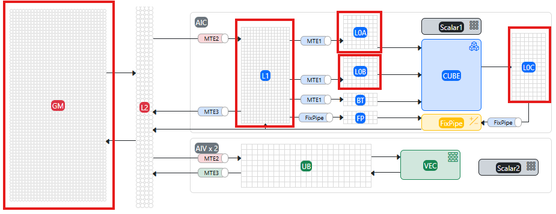

# **典型案例**

## 上板调试Vector算子

**概述**

展示如何使用msDebug工具来上板调试一个Vector算子，该Vector算子可实现两个向量相加并输出结果的功能。

**前期准备**

- 单击[链接](https://gitcode.com/Ascend/mstt/tree/master/sample)获取样例工程，为进行算子调试做准备。
- 完成相关环境变量配置，请参见[MindStudio Debugger工具用户指南](../user_guide/msdebug_user_guide.md)。

**操作步骤**

1. 基于样例工程编译算子，获取可执行文件add.fatbin。
    1. 修改sample/normal_sample/vec_only/Makefile中的COMPILER_FLAG编译选项，将`-O2`修改为`-O0 -g --cce-ignore-always-inline=true`，使能编译器调试功能。

        ```bash
        # Makefile
        ...
        COMPILER            := $(ASCEND_HOME_PATH)/compiler/ccec_compiler/bin/ccec
        COMPILER_FLAG       := -xcce -O0 -g --cce-ignore-always-inline=true -std=c++17 # 使能编译器调试功能
        ```

    2. 执行以下命令完成算子编译。

        > [!NOTE]    
        > 非首次场景，可以使用make clean && make命令替代make命令。

        ```bash
        cd ./mstt/sample/normal_sample/vec_only/
        make clean && make
        ```

2. 设置断点。
    1. 启动msDebug工具拉起算子程序，进入调试界面。

        ```bash
        msdebug add.fatbin  
        (msdebug) target create "add.fatbin"
        Current executable set to '/home/mindstudio/projects/mstt/sample/build/add.fatbin' (aarch64).
        (msdebug) 
        ```

    2. 该sample中核函数的代码实现位于add_kernel.cpp中，在此文件中，为需要的代码行设置NPU断点。

        ```bash
        (msdebug) b add_kernel.cpp:69
        Breakpoint 1: where = device_debugdata`::add_custom(uint8_t *, uint8_t *, uint8_t *) + 18804 [inlined] 
        KernelAdd::Compute(int) + 5144 at add_kernel.cpp:69:9, address = 0x0000000000004974
        (msdebug) 
        ```

3. 运行算子程序。

    程序会开始运行直到命中第一个断点（add_kernel.cpp:69）后停下，msDebug检测到NPU核函数add_custom开始运行，运行在Device 0。

    ```cpp
    (msdebug) run
    Process 730254 launched
    [Launch of Kernel add_custom on Device 0]
    Process 730254 stopped
    [Switching to focus on Kernel add_custom, CoreId 13, Type aiv]
    * thread #1, name = 'add.fatbin', stop reason = breakpoint 2.1
        frame #0: 0x0000000000004974 device_debugdata`::add_custom(uint8_t *, uint8_t *, uint8_t *) [inlined] KernelAdd::Compute(this=0x000000000019a930, progress=0) at add_kernel.cpp:69:9
       66              // call Add instr for computation
       67              Add(zLocal, xLocal, yLocal, TILE_LENGTH);
       68              // enque the output tensor to VECOUT queue
    -> 69              outQueueZ.EnQue<int16_t>(zLocal);  # 断点位置
       70              // free input tensors for reuse
       71              inQueueX.FreeTensor(xLocal);
       72              inQueueY.FreeTensor(yLocal);
    (msdebug)
    ```

4. 检视信息。
    - 使用ascend info cores命令查询NPU核信息。

        ```bash
        (msdebug) ascend info cores 
          CoreId  Type  Device Stream Task Block         PC               Exception
        *  13     aiv      0     3     0     0     0x1240c0034974         f0000000
           14     aiv      0     3     0     1     0x1240c0034974         f0000000
           15     aiv      0     3     0     2     0x1240c0034974         f0000000
           20     aiv      0     3     0     3     0x1240c0034974         f0000000
           21     aiv      0     3     0     4     0x1240c0034974         f0000000
           22     aiv      0     3     0     5     0x1240c0034974         f0000000
           23     aiv      0     3     0     6     0x1240c0034974         f0000000
           24     aiv      0     3     0     7     0x1240c0034974         f0000000
        (msdebug)
        ```

    - 使用print命令直接打印变量信息。

        ```bash
        (msdebug) print progress 
        (int32_t) $0 = 0
        ```

    - 使用print命令与memory read命令配合可打印出Tensor变量中存放的值。
        - 打印位于UB内存上的LocalTensor中存放的数据。

            > [!NOTE]    
            > UB内存打印起始地址需参考LocalTensor变量展示的**address_**字段中的bufferAddr参数。此处以变量**xLocal**为例，其内存起始地址为**0**。

            ```bash
            (msdebug) print xLocal
            (AscendC::LocalTensor<short>) $0 = {
              address_ = (dataLen = 256, bufferAddr = 0, bufferHandle = "", logicPos = '\t')
              shapeInfo_ = {
                shapeDim = '\0'
                originalShapeDim = '\0'
                shape = ([0] = 0, [1] = 0, [2] = 0, [3] = 0, [4] = 0, [5] = 0, [6] = 0, [7] = 0)
                originalShape = ([0] = 0, [1] = 0, [2] = 0, [3] = 0, [4] = 0, [5] = 0, [6] = 0, [7] = 0)
                dataFormat = ND
              }
            }
            (msdebug) memory read -m UB -f int16_t[] 0 -s 256 -c 1
            0x00000000: {0 1 2 3 4 5 6 7 8 9 10 11 12 13 14 15 16 17 18 19 20 21 22 23 24 25 26 27 28 29 30 31 32 33 34 35 36 37 38 39 40 41 42 43 44 45 46 47 48 49 50 51 52 53 54 55 56 57 58 59 60 61 62 63 64 65 66 67 68 69 70 71 72 73 74 75 76 77 78 79 80 81 82 83 84 85 86 87 88 89 90 91 92 93 94 95 96 97 98 99 100 101 102 103 104 105 106 107 108 109 110 111 112 113 114 115 116 117 118 119 120 121 122 123 124 125 126 127}
            (msdebug) 
            ```

        - 打印位于GM内存上的GlobalTensor中存放的数据。

            > [!NOTE]    
            > GM内存打印的起始地址需参考GlobalTensor变量展示的**address_**字段。此处以变量**xGm**为例，其内存起始地址为**0x00001240c0015000**。

            ```bash
            (msdebug) print xGm
            (AscendC::GlobalTensor<short>) $0 = {
              bufferSize_ = 2048
              shapeInfo_ = {
                shapeDim = '\0'
                originalShapeDim = '\0'
                shape = ([0] = 0, [1] = 0, [2] = 0, [3] = 0, [4] = 0, [5] = 0, [6] = 0, [7] = 0)
                originalShape = ([0] = 0, [1] = 0, [2] = 0, [3] = 0, [4] = 0, [5] = 0, [6] = 0, [7] = 0)
                dataFormat = ND
              }
              address_ = 0x00001240c0015000
            }
            (msdebug) memory read -m GM -f int16_t[] 0x00001240c0015000 -s 256 -c 1
            0x1240c0015000: {0 1 2 3 4 5 6 7 8 9 10 11 12 13 14 15 16 17 18 19 20 21 22 23 24 25 26 27 28 29 30 31 32 33 34 35 36 37 38 39 40 41 42 43 44 45 46 47 48 49 50 51 52 53 54 55 56 57 58 59 60 61 62 63 64 65 66 67 68 69 70 71 72 73 74 75 76 77 78 79 80 81 82 83 84 85 86 87 88 89 90 91 92 93 94 95 96 97 98 99 100 101 102 103 104 105 106 107 108 109 110 111 112 113 114 115 116 117 118 119 120 121 122 123 124 125 126 127}
            ```

    - 进行核切换，切换至另一个aiv核，并打印需要的信息。

        ```cpp
        (msdebug) ascend aiv 24  // ascend info cores中选择block 7对应的coreId,此处为24
        [Switching to focus on Kernel add_custom, CoreId 24, Type aiv]
        * thread #1, name = 'add.fatbin', stop reason = breakpoint 2.1
            frame #0: 0x0000000000004974 device_debugdata`::add_custom(uint8_t *, uint8_t *, uint8_t *) [inlined] KernelAdd::Compute(this=0x00000000001c6930, progress=0) at add_kernel.cpp:69:9
           66              // call Add instr for computation
           67              Add(zLocal, xLocal, yLocal, TILE_LENGTH);
           68              // enque the output tensor to VECOUT queue
        -> 69              outQueueZ.EnQue<int16_t>(zLocal);
                        ^
           70              // free input tensors for reuse
           71              inQueueX.FreeTensor(xLocal);
           72              inQueueY.FreeTensor(yLocal);
        (msdebug) p xLocal
        (AscendC::LocalTensor<short>) $0 = {
          address_ = (dataLen = 256, bufferAddr = 0, bufferHandle = "", logicPos = '\t')
          shapeInfo_ = {
            shapeDim = '\0'
            originalShapeDim = '\0'
            shape = ([0] = 0, [1] = 0, [2] = 0, [3] = 0, [4] = 0, [5] = 0, [6] = 0, [7] = 0)
            originalShape = ([0] = 0, [1] = 0, [2] = 0, [3] = 0, [4] = 0, [5] = 0, [6] = 0, [7] = 0)
            dataFormat = ND
          }
        }
        (msdebug) memory read -m UB -f int16_t[] 0 -s 256 -c 1
        0x00000000: {14336 14337 14338 14339 14340 14341 14342 14343 14344 14345 14346 14347 14348 14349 14350 14351 14352 14353 14354 14355 14356 14357 14358 14359 14360 14361 14362 14363 14364 14365 14366 14367 14368 14369 14370 14371 14372 14373 14374 14375 14376 14377 14378 14379 14380 14381 14382 14383 14384 14385 14386 14387 14388 14389 14390 14391 14392 14393 14394 14395 14396 14397 14398 14399 14400 14401 14402 14403 14404 14405 14406 14407 14408 14409 14410 14411 14412 14413 14414 14415 14416 14417 14418 14419 14420 14421 14422 14423 14424 14425 14426 14427 14428 14429 14430 14431 14432 14433 14434 14435 14436 14437 14438 14439 14440 14441 14442 14443 14444 14445 14446 14447 14448 14449 14450 14451 14452 14453 14454 14455 14456 14457 14458 14459 14460 14461 14462 14463}
        (msdebug)
        ```

5. 查询并删除断点，恢复程序运行。

    ```bash
    (msdebug) breakpoint list
    Current breakpoints:
    1: name = 'main', locations = 1, resolved = 1, hit count = 1
      1.1: where = add.fatbin`main + 36 at main.cpp:39:12, address = 0x0000aaaaaab0f568, resolved, hit count = 1 
    2: file = 'add_kernel.cpp', line = 69, exact_match = 0, locations = 1, resolved = 1, hit count = 1
      2.1: where = device_debugdata`::add_custom(uint8_t *, uint8_t *, uint8_t *) + 18804 [inlined] KernelAdd::Compute(int) + 5144 at add_kernel.cpp:69:9, address = 0x0000000000004974, resolved, hit count = 1 
    (msdebug) breakpoint delete 2
    1 breakpoints deleted; 0 breakpoint locations disabled.
    (msdebug) continue 
    Process 730254 resuming
    0 2 4 6 8 10 12 14                                                             
    16 18 20 22 24 26 28 30 
    Process 730254 exited with status = 0 (0x00000000) 
    ```

6. 调试完以后，执行q命令并输入Y或y结束调试。

    ```bash
    (msdebug) q
    Quitting LLDB will kill one or more processes. Do you really want to proceed: [Y/n] y
    ```

## 调用Ascend CL单算子

**前期准备**

单击[链接](https://gitee.com/ascend/samples/tree/master/operator/ascendc/0_introduction/1_add_frameworklaunch/AddCustom)获取算子样例工程，为进行算子调试做准备。

> [!NOTE] 
> 
>- 此样例工程不支持<term>Atlas A3 训练系列产品</term>。
>- 下载代码样例时，需执行以下命令指定分支版本。
>
>    ```bash
>    git clone https://gitee.com/ascend/samples.git -b v0.2-8.0.0.beta1
>    ```

**操作步骤**

1. 切换到msOpGen脚本install.sh所在目录。

    ```bash
    cd ${git_clone_path}/samples/operator/ascendc/0_introduction/1_add_frameworklaunch
    ```

2. 执行以下命令，生成自定义算子工程，并进行Host侧和Kernel侧的算子实现。

    ```bash
    bash install.sh -v Ascendxxxyy    # xxxyy为用户实际使用的具体芯片类型
    ```

3. 在${git_clone_path}/samples/operator/ascendc/0_introduction/1_add_frameworklaunch/CustomOp目录下修改CMakePresets.json文件的cacheVariables的配置项，将`"Release"`修改为`"Debug"`。

    ```bash
    "cacheVariables": {               
           "CMAKE_BUILD_TYPE": {                    
                "type": "STRING",                    
                "value": "Debug"               
      },
    ...
    }
    ```

4. 参考[算子编译部署](https://www.hiascend.com/document/detail/zh/mindstudio/82RC1/ODtools/Operatordevelopmenttools/atlasopdev_16_0024.html)完成算子的编译部署。<a id="步骤4算子编译"></a>
5. 切换到msOpGen脚本install.sh所在目录，并参考[README](https://gitee.com/ascend/samples/blob/master/operator/ascendc/0_introduction/1_add_frameworklaunch/AclNNInvocation/README.md)编译单算子调用应用并得到可执行文件**execute_add_op**。<a id="步骤5"></a>

    ```bash
    cd ${git_clone_path}/samples/operator/ascendc/0_introduction/1_add_frameworklaunch/AclNNInvocation
    ```

6. 导入算子动态加载路径。

    将自定义算子工程编译后输出在build_out目录下Kernel侧的`.o`文件路径导入环境变量。

    ```bash
    export LAUNCH_KERNEL_PATH=/{path_to_kernel}/kernel_name.o  # {path_to_kernel}表示对算子Kernel侧实现编译后生成的算子二进制文件*.o所在路径，请根据实际情况进行替换
    ```

    > [!NOTE]    
    > 算子的多个dtype在Kernel侧可能会编译出多个`.o`文件，请选择[4](#步骤4算子编译)示例中所调用的`.o`文件进行导入。

7. 使用msDebug工具加载[5](#步骤5)中得到的单算子可执行文件execute_add_op。

    ```bash
    export LD_LIBRARY_PATH=$ASCEND_HOME_PATH/opp/vendors/customize/op_api/lib:$LD_LIBRARY_PATH
    cd AclNNInvocation/output
    msdebug execute_add_op
    (msdebug) target create "execute_add_op"
    Current executable set to '/home/AclNNInvocation/output/execute_add_op' (aarch64).
    (msdebug)
    ```

8. 断点设置。

    ```bash
    b add_custom.cpp:55
    ```

9. 运行算子程序，等待直到命中断点。

    ```bash
    (msdebug) r
    Process 1385976 launched: '$HOME/shelltest/test/samples/operator/ascendc/0_introduction/1_add_frameworklaunch/AclNNInvocationNaive/build/execute_add_op' (aarch64)
    [Launch of Kernel anonymous on Device 0]
    Process 1385976 stopped
    [Switching to focus on Kernel anonymous, CoreId 24, Type aiv]
    * thread #1, name = 'execute_add_op', stop reason = breakpoint 1.1
        frame #0: 0x0000000000001564 AddCustom_1e04ee05ab491cc5ae9c3d5c9ee8950b.o`KernelAdd::Compute(this=0x000000000028f8a8, progress=0) (.vector) at add_custom.cpp:55:19
       52           LocalTensor<DTYPE_Y> yLocal = inQueueY.DeQue<DTYPE_Y>();
       53           LocalTensor<DTYPE_Z> zLocal = outQueueZ.AllocTensor<DTYPE_Z>();
       54           Add(zLocal, xLocal, yLocal, this->tileLength);
    -> 55           outQueueZ.EnQue<DTYPE_Z>(zLocal);
       56           inQueueX.FreeTensor(xLocal);
       57           inQueueY.FreeTensor(yLocal);
       58       }
    (msdebug) 
    ```

    > [!NOTE]    
    > 后续调试过程可参考[导入调试信息](../user_guide/msdebug_user_guide.md#工具使用)、[内存与变量打印功能介绍](../user_guide/msdebug_user_guide.md#内存与变量打印功能介绍)及[核切换功能介绍](../user_guide/msdebug_user_guide.md#核切换功能介绍)等，与其操作一致。

## 调试PyTorch接口调用的算子

**概述**

展示如何使用msDebug工具来上板调试一个PyTorch接口调用的add算子，该add算子可实现两个向量相加并输出结果的功能。

**前期准备**

- 单击[链接](https://gitee.com/ascend/samples/tree/master/operator/ascendc/0_introduction/1_add_frameworklaunch/AddCustom)获取样例工程，为进行算子调试做准备。

    > [!NOTE] 
    > 
    > - 此样例工程仅支持Python3.9，若要在其他Python版本上运行，需要修改${git_clone_path}/samples/operator/ascendc/0_introduction/1_add_frameworklaunch/PytorchInvocation目录下run_op_plugin.sh文件中的Python版本。
    > - 此样例工程不支持<term>Atlas A3 训练系列产品</term>。
    > - 下载代码样例时，需执行以下命令指定分支版本。
>
    >    ```bash
    >    git clone https://gitee.com/ascend/samples.git -b v0.2-8.0.0.beta1
    >    ```

- 已参考《[Ascend Extension for PyTorch 软件安装指南](https://www.hiascend.com/document/detail/zh/Pytorch/720/configandinstg/instg/insg_0001.html)》，完成PyTorch框架和torch_npu插件的安装。
- 完成相关环境变量配置，请参见[MindStudio Debugger工具用户指南](../user_guide/msdebug_user_guide.md)。

**操作步骤**

1. 执行以下命令，可生成自定义算子工程，并进行Host侧和Kernel侧的算子实现。

    ```bash
    bash install.sh -v Ascendxxxyy    # xxxyy为用户实际使用的具体芯片类型
    ```

2. 在${git_clone_path}/samples/operator/ascendc/0_introduction/1_add_frameworklaunch/CustomOp目录下修改CMakePresets.json文件的cacheVariables的配置项，将`"Release"`修改为`"Debug"`。

    ```bash
    "cacheVariables": {               
           "CMAKE_BUILD_TYPE": {                    
               "type": "STRING",                    
               "value": "Debug"               
           },
    ...
    }
    ```

3. 参考[算子编译部署](https://www.hiascend.com/document/detail/zh/mindstudio/82RC1/ODtools/Operatordevelopmenttools/atlasopdev_16_0024.html)，完成算子的编译部署。
4. 进入到样例目录，以命令行方式下载样例代码。参考[README](https://gitee.com/ascend/samples/blob/master/operator/ascendc/0_introduction/1_add_frameworklaunch/README.md)使用PyTorch调用方式调用AddCustom算子工程，并按照指导完成编译。

    ```bash
    cd ${git_clone_path}/samples/operator/ascendc/0_introduction/1_add_frameworklaunch/PytorchInvocation
    ```

    > [!NOTE]    
    > PyTorch接入工程的样例工程目录如下：
>
    > ```text
    > PytorchInvocation
    > ├── op_plugin_patch  
    > ├── README.md        //使用PyTorch调用方式调用AddCustom算子工程的注册样例
    > ├── run_op_plugin.sh      //  执行样例时，需要使用
    > └── test_ops_custom.py    //  启动工具时,需要使用
    > └── test_ops_custom_register_in_graph.py  // 执行torch.compile模式下用例脚本
    > ```

5. 执行样例，样例执行过程中会自动生成测试数据，然后运行PyTorch样例，最后检验运行结果。

    ```bash
    bash run_op_plugin.sh
    -- CMAKE_CCE_COMPILER: ${INSTALL_DIR}/toolkit/tools/ccec_compiler/bin/ccec
    -- CMAKE_CURRENT_LIST_DIR: ${INSTALL_DIR}/AddKernelInvocation/cmake/Modules
    -- ASCEND_PRODUCT_TYPE:
      Ascendxxxyy
    -- ASCEND_CORE_TYPE:
      VectorCore
    -- ASCEND_INSTALL_PATH:
      /usr/local/Ascend/cann
    -- The CXX compiler identification is GNU 10.3.1
    -- Detecting CXX compiler ABI info
    -- Detecting CXX compiler ABI info - done
    -- Check for working CXX compiler: /usr/bin/c++ - skipped
    -- Detecting CXX compile features
    -- Detecting CXX compile features - done
    -- Configuring done
    -- Generating done
    -- Build files have been written to: ${INSTALL_DIR}/AddKernelInvocation/build
    Scanning dependencies of target add_npu
    ...
    [100%] Built target add_npu
    INFO: Ascend C Add Custom SUCCESS
    ...
    INFO: Ascend C Add Custom  in torch.compile graph SUCCESS
    ```

6. 手动导入算子调试信息，示例如下。

    > [!NOTE] 
    > 
    > - ${INSTALL_DIR}请替换为CANN软件安装后文件存储路径。以root安装举例，则安装后文件存储路径为：/usr/local/Ascend/cann。
    > - 非<term>Atlas A3 训练系列产品/Atlas A3 推理系列产品</term>：在安装昇腾AI处理器的服务器执行`npu-smi info`命令进行查询，获取**Chip Name**信息。实际配置值为AscendChip Name，例如**Chip Name**取值为xxxyy，实际配置值为Ascend_xxxyy_。当Ascendxxxyy为代码样例的路径时，需要配置为ascendxxxyy。
    > - <term>Atlas A3 训练系列产品/Atlas A3 推理系列产品</term>：在安装昇腾AI处理器的服务器执行`npu-smi info -t board -i id -c chip_id`命令进行查询，获取**Chip Name**和**NPU Name**信息，实际配置值为Chip Name_NPU Name。例如**Chip Name**取值为Ascendxxx，**NPU Name**取值为1234，实际配置值为Ascendxxx_1234。当Ascendxxx_1234为代码样例的路径时，需要配置为ascendxxx_1234。
    >    其中：
    >    - id：设备id，通过`npu-smi info -l`命令查出的NPU ID即为设备id。
    >    - chip_id：芯片id，通过`npu-smi info -m`命令查出的Chip ID即为芯片id。

    ```bash
    export LAUNCH_KERNEL_PATH=${INSTALL_DIR}/opp/vendors/customize/op_impl/ai_core/tbe/kernel/SOC_VERSION/add_custom/AddCustom_1e04ee05ab491cc5ae9c3d5c9ee8950b.o
    ```

7. 启动msDebug工具拉起Python程序，进入调试界面。

    ```bash
    msdebug python3 test_ops_custom.py
    (msdebug) target create "python3"
    Current executable set to '/home/mindstudio/miniconda3/envs/py39/bin/python3' (aarch64).
    (msdebug) settings set -- target.run-args  "test_ops_custom.py"
    (msdebug)
    ```

8. 设置断点。

    根据指定源码文件与对应行号，在核函数中设置NPU断点。

    ```bash
    (msdebug) b add_custom.cpp:60
    Breakpoint 1: where = AddCustom_1e04ee05ab491cc5ae9c3d5c9ee8950b.o`::AddCustom_1e04ee05ab491cc5ae9c3d5c9ee8950b_1(uint8_t *, uint8_t *, uint8_t *, uint8_t *, uint8_t *) + 9912 [inlined] KernelAdd::Compute(int) + 3400 at add_custom.cpp:60:9, address = 0x00000000000026b8
    ```

9. 运行程序，等待直到命中断点。

    ```bash
    (msdebug) r
    Process 197189 launched: '/home/miniconda3/envs/py39/bin/python3' (aarch64)
    Process 197189 stopped and restarted: thread 1 received signal: SIGCHLD
    ...
    [Launch of Kernel anonymous on Device 0]
    Process 197189 stopped
    [Switching to focus on Kernel anonymous, CoreId 8, Type aiv]
    * thread #1, name = 'python3', stop reason = breakpoint 2.1
        frame #0: 0x00000000000026b8 AddCustom_1e04ee05ab491cc5ae9c3d5c9ee8950b.o`::AddCustom_1e04ee05ab491cc5ae9c3d5c9ee8950b_1(uint8_t *, uint8_t *, uint8_t *, uint8_t *, uint8_t *) [inlined] KernelAdd::Compute(this=0x000000000020efb8, progress=1) at add_custom.cpp:60:9
       57              LocalTensor<DTYPE_Y> yLocal = inQueueY.DeQue<DTYPE_Y>();
       58              LocalTensor<DTYPE_Z> zLocal = outQueueZ.AllocTensor<DTYPE_Z>();
       59              Add(zLocal, xLocal, yLocal, this->tileLength);
    -> 60              outQueueZ.EnQue<DTYPE_Z>(zLocal);
       61              inQueueX.FreeTensor(xLocal);
       62              inQueueY.FreeTensor(yLocal);
       63          }
    (msdebug)
    ```

    > [!NOTE]  
    > 其他调试操作可参考[导入调试信息](../user_guide/msdebug_user_guide.md#工具使用)、[内存与变量打印功能介绍](../user_guide/msdebug_user_guide.md#内存与变量打印功能介绍)、[调试信息展示功能介绍](../user_guide/msdebug_user_guide.md#调试信息展示功能介绍)及[核切换功能介绍](../user_guide/msdebug_user_guide.md#核切换功能介绍)等，与其操作一致。

10. 删除断点，具体操作请参见[断点设置功能介绍](../user_guide/msdebug_user_guide.md#断点设置功能介绍)。
11. 调试完以后，执行q命令并输入Y或y结束调试。

    ```bash
    (msdebug) q
    Quitting LLDB will kill one or more processes. Do you really want to proceed: [Y/n] y
    ```

## 上板调试模板库的算子

**概述**

展示如何使用msDebug工具来上板调试一个模板库算子（matmul），该算子可实现两个矩阵相乘并输出结果的功能。

**前期准备**<a id="前期准备"></a>

- 单击[链接](https://gitcode.com/cann/catlass)获取样例工程，为进行算子调试做准备。
- 完成相关环境变量配置，请参见[MindStudio Debugger工具用户指南](../user_guide/msdebug_user_guide.md)。

**操作步骤**

1. 基于[前期准备](#前期准备)中的样例工程编译算子，获取可执行文件00_basic_matmul。

    执行以下命令完成算子编译，编译完成后，在build/bin目录下生成可执行文件00_basic_matmul。

    ```bash
    bash ./scripts/build.sh 00_basic_matmul --debug --msdebug
    ```

2. 启动msDebug工具拉起算子程序，进入调试界面。

    ```bash
    msdebug ./build/bin/00_basic_matmul 256 512 1024 0
    (msdebug) target create "./build/bin/00_basic_matmul"
    Current executable set to '/home/mindstudio/projects/ascendc-templates/build/bin/00_basic_matmul' (aarch64).
    (msdebug) 
    ```

3. 设置断点。

    该用例中核函数的代码实现位于basic_matmul.hpp中，在此文件中，为需要的代码行设置NPU断点。

    ```bash
    (msdebug) b basic_matmul.hpp:121
    Breakpoint 1: 2 locations.
    (msdebug) 
    ```

4. 运行算子程序，等待直到命中断点。

    程序会开始运行直到命中第一个断点（basic_matmul.hpp:127）后停下，msDebug检测到NPU核函数开始运行，运行在Device 0。

    ```cpp
    (msdebug) run
    Process 3344307 launched: '/home/mindstudio/projects/ascendc-templates/build/bin/00_basic_matmul' (aarch64)
    [Launch of Kernel _ZN7Catlass13KernelAdapterINS_4Gemm6Kernel11BasicMatmulINS1_5Blo on Device 0] 
    Process 3344307 stopped
    [Switching to focus on Kernel _ZN7Catlass13KernelAdapterINS_4Gemm6Kernel11BasicMatmulINS1_5Blo, CoreId 21, Type aic]
    * thread #1, name = '00_basic_matmul', stop reason = breakpoint 1.1
        frame #0: 0x0000000000001c38 device_debugdata`_ZN7Catlass13KernelAdapterINS_4Gemm6Kernel11BasicMatmulINS1_5Block9BlockMmadINS1_19MmadAtlasA2PingpongILb1EEENS_9GemmShapeILj128ELj256ELj256EEENS8_ILj128ELj256ELj64EEENS1_8GemmTypeIDhNS_6layout8RowMajorELN7AscendC9TPositionE0EEESG_SG_vNS1_4Tile8TileCopyINS_4Arch7AtlasA2ESG_SG_SG_vEENSH_8TileMmadISK_SG_SG_vEEEEvNS4_24GemmIdentityBlockSwizzleILj3ELj0EEEEEEEvNT_6ParamsE_mix_aic at basic_matmul.hpp:121:71
       118
       119          for (uint32_t loopIdx = AscendC::GetBlockIdx(); loopIdx < coreLoops; loopIdx += AscendC::GetBlockNum()) {
       120              // Compute block location
    -> 121              GemmCoord blockCoord = matmulBlockScheduler.GetBlockCoord(loopIdx);
       122              GemmCoord actualBlockShape = matmulBlockScheduler.GetActualBlockShape(blockCoord);
       123
       124              // Compute initial location in logical coordinates
    (msdebug)
    ```

    > [!NOTE]    
    > **_ZN7Catlass13KernelAdapterINS_4Gemm6Kernel11BasicMatmulINS1_5Blo**为模板库的kernel名字，示例仅显示前面64位。

5. 检视信息。

    - 使用ascend info cores命令查询NPU核信息。

        ```bash
        (msdebug) ascend info cores 
          CoreId  Type  Device Stream Task Block         PC               stop reason
        *  21     aic      0     48     0     0     0x12c0c00d6c38         breakpoint 1.1
           22     aic      0     48     0     1     0x12c0c00d6c38         breakpoint 1.1
           23     aic      0     48     0     2     0x12c0c00d6c38         breakpoint 1.1
           24     aic      0     48     0     3     0x12c0c00d6c38         breakpoint 1.1
        (msdebug)
        ```

    - 使用print命令直接打印**gmA**变量信息。

        ```bash
        (msdebug) print gmA 
        (AscendC::GlobalTensor<__fp16>) $0 = {
          AscendC::BaseGlobalTensor<__fp16> = {
            address_ = 0x000012c0c0013000
            oriAddress_ = 0x000012c0c0013000
          }
          bufferSize_ = 0
          cacheMode_ = CACHE_MODE_NORMAL
        }
        ```

    - 继续使用memory read命令可打印出gmA变量中存放的值。
        - 打印位于GM内存上的gmA中存放的数据。

            ```bash
            (msdebug) memory read -m GM 0x12c0c0013000 -f float16[] -s 256 -c 1
            0x12c0c0013000: {3.40234 -1.05664 2.83008 2.98438 4.11719 -3.02539 -1.64746 2.68164 -2.22266 0.539551 -0.226074 1.28906 -1.35254 0.134033 4.52344 4.16016 1.35742 2.17383 -3.58398 1.06934 -4.83594 -2.57031 -3.62695 3.04102 -3.43359 -0.990723 -3.70117 -3.91211 4.98828 -2.81836 0.129272 3.39062 1.12598 -2.03906 1.37598 0.24292 -0.0641479 4.72656 -2.07422 2.71289 0.267334 2.69922 -0.997559 3.91602 -2.16602 -1.47559 3.07812 4.19141 -4.30078 4.49219 0.26001 -4.14062 -3.07812 1.63184 3.90234 -1.51074 -4.35938 -4.80078 -0.423096 -4.36719 -2.61719 4.70703 4.02344 3.50977 -2.33398 0.397705 -1.24805 2.60156 0.125366 1.67676 0.316162 -4.60547 -0.623535 4.31641 4.30859 2.20898 -2.15625 2.38477 1.39941 -1.45996 1.87891 -3.33984 -0.599121 3.80078 3.29297 -1.69629 -2.71094 3.93359 -1.49609 1.86621 4.56641 0.88623 1.57324 3.58594 -0.604492 4.23828 -1.01562 3.14844 1.8418 4.10938 -0.175049 -2.8418 4.50391 4.20312 -3.52344 3.81055 1.41113 -0.680664 1.19629 -2.18945 2.85938 -1.92578 -0.529785 -2.73828 -3.125 -2.23828 0.564453 -0.834961 -3.30469 4.06641 -3.96875 -3.73828 -0.0455627 2.60547 4.84766 4.35156 1.84473 -1.16797}
            (msdebug) 
            ```

    - 进行核切换，切换至另一个aic核，并打印需要的信息。

        ```cpp
        (msdebug) ascend aic 24  // ascend info cores中选择block 3对应的coreId,此处为24
        [Switching to focus on Kernel _ZN7Catlass13KernelAdapterINS_4Gemm6Kernel11BasicMatmulINS1_5Blo, CoreId 24, Type aic]
        * thread #1, name = '00_basic_matmul', stop reason = breakpoint 1.1
            frame #0: 0x0000000000001c38 device_debugdata`_ZN7Catlass13KernelAdapterINS_4Gemm6Kernel11BasicMatmulINS1_5Block9BlockMmadINS1_19MmadAtlasA2PingpongILb1EEENS_9GemmShapeILj128ELj256ELj256EEENS8_ILj128ELj256ELj64EEENS1_8GemmTypeIDhNS_6layout8RowMajorELN7AscendC9TPositionE0EEESG_SG_vNS1_4Tile8TileCopyINS_4Arch7AtlasA2ESG_SG_SG_vEENSH_8TileMmadISK_SG_SG_vEEEEvNS4_24GemmIdentityBlockSwizzleILj3ELj0EEEEEEEvNT_6ParamsE_mix_aic at basic_matmul.hpp:121:71
           118
           119          for (uint32_t loopIdx = AscendC::GetBlockIdx(); loopIdx < coreLoops; loopIdx += AscendC::GetBlockNum()) {
           120              // Compute block location
        -> 121              GemmCoord blockCoord = matmulBlockScheduler.GetBlockCoord(loopIdx);
           122              GemmCoord actualBlockShape = matmulBlockScheduler.GetActualBlockShape(blockCoord);
           123
           124              // Compute initial location in logical coordinates
        (msdebug) p loopIdx
        (uint32_t) $1 = 0
        ```

    > [!NOTE]    
    > 其他调试操作可参考[内存与变量打印功能介绍](../user_guide/msdebug_user_guide.md#内存与变量打印功能介绍)、[调试信息展示功能介绍](../user_guide/msdebug_user_guide.md#调试信息展示功能介绍)及[核切换功能介绍](../user_guide/msdebug_user_guide.md#核切换功能介绍)等，与其操作一致。

6. 查询并删除断点，恢复程序运行。

    ```bash
    (msdebug) breakpoint list
    Current breakpoints:
    1: file = 'basic_matmul.hpp', line = 121, exact_match = 0, locations = 2, resolved = 2, hit count = 1
      1.1: where = device_debugdata`_ZN7Catlass13KernelAdapterINS_4Gemm6Kernel11BasicMatmulINS1_5Block9BlockMmadINS1_19MmadAtlasA2PingpongILb1EEENS_9GemmShapeILj128ELj256ELj256EEENS8_ILj128ELj256ELj64EEENS1_8GemmTypeIDhNS_6layout8RowMajorELN7AscendC9TPositionE0EEESG_SG_vNS1_4Tile8TileCopyINS_4Arch7AtlasA2ESG_SG_SG_vEENSH_8TileMmadISK_SG_SG_vEEEEvNS4_24GemmIdentityBlockSwizzleILj3ELj0EEEEEEEvNT_6ParamsE_mix_aic + 4748 [inlined] _ZN7Catlass4Gemm6Kernel11BasicMatmulINS0_5Block9BlockMmadINS0_19MmadAtlasA2PingpongILb1EEENS_9GemmShapeILj128ELj256ELj256EEENS7_ILj128ELj256ELj64EEENS0_8GemmTypeIDhNS_6layout8RowMajorELN7AscendC9TPositionE0EEESF_SF_vNS0_4Tile8TileCopyINS_4Arch7AtlasA2ESF_SF_SF_vEENSG_8TileMmadISJ_SF_SF_vEEEEvNS3_24GemmIdentityBlockSwizzleILj3ELj0EEEEclILi1EEEvRKNSQ_6ParamsE_mix_aic + 4632 at basic_matmul.hpp:121:71, address = 0x0000000000001c38, resolved, hit count = 1
      1.2: where = device_debugdata`_ZN7Catlass13KernelAdapterINS_4Gemm6Kernel11BasicMatmulINS1_5Block9BlockMmadINS1_19MmadAtlasA2PingpongILb1EEENS_9GemmShapeILj128ELj256ELj256EEENS8_ILj128ELj256ELj64EEENS1_8GemmTypeIDhNS_6layout8RowMajorELN7AscendC9TPositionE0EEESG_SG_vNS1_4Tile8TileCopyINS_4Arch7AtlasA2ESG_SG_SG_vEENSH_8TileMmadISK_SG_SG_vEEEEvNS4_24GemmIdentityBlockSwizzleILj3ELj0EEEEEEEvNT_6ParamsEm_mix_aic + 4772 [inlined] _ZN7Catlass4Gemm6Kernel11BasicMatmulINS0_5Block9BlockMmadINS0_19MmadAtlasA2PingpongILb1EEENS_9GemmShapeILj128ELj256ELj256EEENS7_ILj128ELj256ELj64EEENS0_8GemmTypeIDhNS_6layout8RowMajorELN7AscendC9TPositionE0EEESF_SF_vNS0_4Tile8TileCopyINS_4Arch7AtlasA2ESF_SF_SF_vEENSG_8TileMmadISJ_SF_SF_vEEEEvNS3_24GemmIdentityBlockSwizzleILj3ELj0EEEEclILi1EEEvRKNSQ_6ParamsE_mix_aic + 4632 at basic_matmul.hpp:121:71, address = 0x000000000000dd54, resolved, hit count = 0
    (msdebug) breakpoint delete 1
    1 breakpoints deleted; 0 breakpoint locations disabled.
    (msdebug) continue 
    Process 3344307 resuming
    Compare success.
    Process 3344307 exited with status = 0 (0x00000000)
    ```

7. 调试完以后，执行q命令并输入Y或y结束调试。

    ```bash
    (msdebug) q
    ```

## 显示调试信息

本节演示如何使用 `msdebug` 命令在调试算子时获取设备、核、任务、流、块以及 Coredump 的相关信息。以下 Triton 脚本同时涉及 Cube 核和 Vector 核。

```python
import torch
import triton
import triton.language as tl

@triton.jit
def mm_kernel(
    a_ptr, b_ptr, c_ptr, d_ptr,
    stride_am: tl.constexpr,
    stride_ak: tl.constexpr,
    stride_bk: tl.constexpr,
    stride_bn: tl.constexpr,
    stride_cm: tl.constexpr,
    stride_cn: tl.constexpr,
    stride_dm: tl.constexpr,
    stride_dn: tl.constexpr,
    BLOCK_M: tl.constexpr,
    BLOCK_K: tl.constexpr,
    BLOCK_N: tl.constexpr
):
    a_ptrs = a_ptr + (tl.arange(0, BLOCK_M)[:, None] * stride_am + tl.arange(0, BLOCK_K)[None, :] * stride_ak)
    b_ptrs = b_ptr + (tl.arange(0, BLOCK_K)[:, None] * stride_bk + tl.arange(0, BLOCK_N)[None, :] * stride_bn)
    c_ptrs = c_ptr + (tl.arange(0, BLOCK_M)[:, None] * stride_cm + tl.arange(0, BLOCK_N)[None, :] * stride_cn)
    d_ptrs = d_ptr + (tl.arange(0, BLOCK_M)[:, None] * stride_dm + tl.arange(0, BLOCK_N)[None, :] * stride_dn)
    
    a = tl.load(a_ptrs)
    b = tl.load(b_ptrs)

    c = tl.dot(a, b)
    
    tl.store(c_ptrs, c)

    d = c + c

    tl.store(d_ptrs, d)


def test_mm(datatype: str, BLOCK_M: int, BLOCK_K: int, BLOCK_N: int) -> torch.Tensor:

    total_elements_a = BLOCK_M * BLOCK_K
    a_flat = torch.arange(total_elements_a, dtype=torch.float16).npu()
    a = a_flat.reshape(BLOCK_M, BLOCK_K)
    b_flat = a_flat * 2
    b = b_flat.reshape(BLOCK_K, BLOCK_N)
    
    c = torch.empty((BLOCK_M, BLOCK_N), dtype=eval(f'torch.{datatype}')).npu()
    d = torch.empty((BLOCK_M, BLOCK_N), dtype=eval(f'torch.{datatype}')).npu()

    mm_kernel[(1,)](
        a,b,c,d,
        a.stride(0), a.stride(1),
        b.stride(0), b.stride(1),
        c.stride(0), c.stride(1),
        d.stride(0), d.stride(1),
        BLOCK_M, BLOCK_K, BLOCK_N
    )

    return d

if __name__ == "__main__":
    output_triton = test_mm('float16', 4,4,4)
    print("output: ", output_triton)
```

在 JIT 函数的第一行设置断点：

```bash
Process 86637 stopped
[Switching to focus on Kernel mm_kernel, CoreId 1, Type aic]
* thread #1, name = 'python', stop reason = breakpoint 1.1
    frame #0: 0x0000124000000384 device_debugdata_1`mm_kernel at matmul.py:18:22
   15       BLOCK_K: tl.constexpr,
   16       BLOCK_N: tl.constexpr
   17   ):
-> 18       a_ptrs = a_ptr + (tl.arange(0, BLOCK_M)[:, None] * stride_am + tl.arange(0, BLOCK_K)[None, :] * stride_ak)
   19       b_ptrs = b_ptr + (tl.arange(0, BLOCK_K)[:, None] * stride_bk + tl.arange(0, BLOCK_N)[None, :] * stride_bn)
   20       c_ptrs = c_ptr + (tl.arange(0, BLOCK_M)[:, None] * stride_cm + tl.arange(0, BLOCK_N)[None, :] * stride_cn)
```

> [!NOTE]
> 如需获取更详细的信息，可以使用以下命令。请记住，**进程必须已启动**。

### ascend info devices

显示设备总体信息。执行以下命令查询算子运行的设备信息，其中 `*` 所在行表示目标设备。

```bash
(msdebug) ascend info devices
  Device Aic_Num Aiv_Num Aic_Mask Aiv_Mask
*    0      1       2      0x4     0xc000000000
```

<table>
<thead align="left">
<tr>
<th width="30%">字段</th>
<th width="70%">说明</th>
</tr>
</thead>
<tbody>
<tr>
<td>Device</td>
<td>设备逻辑 ID。</td>
</tr>
<tr>
<td>Aic_Num</td>
<td>使用的 Cube 核数量。</td>
</tr>
<tr>
<td>Aiv_Num</td>
<td>使用的 Vector 核数量。</td>
</tr>
<tr>
<td>Aic_Mask</td>
<td>使用的 Cube 掩码，用 64 位表示。如果第 n 位为 1，则表示使用了 Cube n。</td>
</tr>
<tr>
<td>Aiv_Mask</td>
<td>使用的 Vector 掩码，用 64 位表示。如果第 n 位为 1，则表示使用了 Vector n。</td>
</tr>
</tbody>
</table>

### ascend info cores

显示 AI Core 总体信息。执行以下命令查询算子运行的核信息，其中 `*` 所在行表示目标核。

```bash
(msdebug) ascend info cores
  CoreId  Type  Device Stream Task Block         PC               stop reason
*   2     aic      0     46     1     0     0x12400000038c         breakpoint 1.1
   38     aiv      0     46     1     0     0x1240000018c4         breakpoint 1.1
   39     aiv      0     46     1     0     0x1240000018c4         breakpoint 1.1
```

<table>
<thead align="left">
<tr>
<th width="30%">字段</th>
<th width="70%">说明</th>
</tr>
</thead>
<tbody>
<tr>
<td>CoreId</td>
<td>AIV 或 AIC 的核 ID，从 0 开始。</td>
</tr>
<tr>
<td>Type</td>
<td>核类型，可以是 <code>aic</code> 或 <code>aiv</code>。</td>
</tr>
<tr>
<td>Device</td>
<td>设备逻辑 ID。</td>
</tr>
<tr>
<td>Stream</td>
<td>当前核函数下发的 Stream ID。Stream 由一系列 Task 组成。</td>
</tr>
<tr>
<td>Task</td>
<td>当前 Stream 中的 Task ID，表示下发给 Task 调度器处理的任务。</td>
</tr>
<tr>
<td>Block</td>
<td>核函数将在哪些核上执行。每个执行核函数的核会被分配一个逻辑 ID，即 Block ID。</td>
</tr>
<tr>
<td>PC</td>
<td>当前核上的 PC 逻辑绝对地址。</td>
</tr>
<tr>
<td>Stop Reason</td>
<td>程序停止的原因，包括 <code>breakpoint</code>、<code>step in</code>、<code>step over</code> 或 <code>Ctrl+C</code>。</td>
</tr>
</tbody>
</table>

### ascend info tasks

显示任务总体信息。执行以下命令查询算子的任务信息，其中 `*` 所在行表示目标任务，包括设备 ID、Stream ID、Task ID 和核函数名称（Invocation）。

```bash
(msdebug) ascend info tasks
  Device Stream Task Invocation
*   0      46     1  mm_kernel
```

### ascend info stream

显示 Stream 总体信息。执行以下命令查询算子的 Stream 信息，其中 `*` 所在行表示目标 Stream，包括设备 ID、Stream ID 和核类型（`aic` 或 `aiv`）。

```bash
(msdebug) ascend info stream
  Device Stream Type
*   0      46    aic
```

### ascend info blocks

显示 Block 总体信息。执行以下命令查询算子的 Block 信息，其中 `*` 所在行表示目标 Block，包括设备 ID、Stream ID、Task ID 和 Block ID。

```bash
(msdebug) ascend info blocks
  Device Stream Task Block
*   0      46     1     0
    0      46     1     0
    0      46     1     0
```

执行以下命令可显示当前断点处所运行 Block 的代码：

```bash
(msdebug) ascend info blocks -d
Current stop state of all blocks:

[* CoreId 3, Block 0]
* thread #1, name = 'python', stop reason = breakpoint 1.1
    frame #0: 0x000012400000038c device_debugdata_1`mm_kernel_mix_aic at matmul_plus.py:20:22
   17       BLOCK_K: tl.constexpr,
   18       BLOCK_N: tl.constexpr
   19   ):
-> 20       a_ptrs = a_ptr + (tl.arange(0, BLOCK_M)[:, None] * stride_am + tl.arange(0, BLOCK_K)[None, :] * stride_ak)
   21       b_ptrs = b_ptr + (tl.arange(0, BLOCK_K)[:, None] * stride_bk + tl.arange(0, BLOCK_N)[None, :] * stride_bn)
   22       c_ptrs = c_ptr + (tl.arange(0, BLOCK_M)[:, None] * stride_cm + tl.arange(0, BLOCK_N)[None, :] * stride_cn)
   23       d_ptrs = d_ptr + (tl.arange(0, BLOCK_M)[:, None] * stride_dm + tl.arange(0, BLOCK_N)[None, :] * stride_dn)

[CoreId 41, Block 0]
* thread #1, name = 'python', stop reason = breakpoint 1.1
    frame #0: 0x00001240000018c4 device_debugdata_1`mm_kernel_mix_aiv at matmul_plus.py:30:21
   27  
   28       c = tl.dot(a, b)
   29       
-> 30       tl.store(c_ptrs, c)
   31  
   32       d = c + c
   33  

[CoreId 42, Block 0]
* thread #1, name = 'python', stop reason = breakpoint 1.1
    frame #0: 0x00001240000018c4 device_debugdata_1`mm_kernel_mix_aiv at matmul_plus.py:30:21
   27  
   28       c = tl.dot(a, b)
   29       
-> 30       tl.store(c_ptrs, c)
   31  
   32       d = c + c
   33  
```

### ascend aiv coreId / ascend aic coreId

切换核：

```bash
(msdebug) ascend info cores
  CoreId  Type  Device Stream Task Block         PC               stop reason
*   2     aic      0     46     1     0     0x12400000038c         breakpoint 1.1
   38     aiv      0     46     1     0     0x1240000018c4         breakpoint 1.1
   39     aiv      0     46     1     0     0x1240000018c4         breakpoint 1.1

(msdebug) ascend aiv 38
[Switching to focus on Kernel mm_kernel, CoreId 38, Type aiv]
* thread #1, name = 'python', stop reason = breakpoint 1.1
    frame #0: 0x00001240000018c4 device_debugdata_1`mm_kernel_mix_aiv at matmul_plus.py:30:21
   27  
   28       c = tl.dot(a, b)
   29       
-> 30       tl.store(c_ptrs, c)
   31  
   32       d = c + c
   33  

(msdebug) ascend aic 2
[Switching to focus on Kernel mm_kernel, CoreId 2, Type aic]
* thread #1, name = 'python', stop reason = breakpoint 1.1
    frame #0: 0x000012400000038c device_debugdata_1`mm_kernel_mix_aic at matmul_plus.py:20:22
   17       BLOCK_K: tl.constexpr,
   18       BLOCK_N: tl.constexpr
   19   ):
-> 20       a_ptrs = a_ptr + (tl.arange(0, BLOCK_M)[:, None] * stride_am + tl.arange(0, BLOCK_K)[None, :] * stride_ak)
   21       b_ptrs = b_ptr + (tl.arange(0, BLOCK_K)[:, None] * stride_bk + tl.arange(0, BLOCK_N)[None, :] * stride_bn)
   22       c_ptrs = c_ptr + (tl.arange(0, BLOCK_M)[:, None] * stride_cm + tl.arange(0, BLOCK_N)[None, :] * stride_cn)
   23       d_ptrs = d_ptr + (tl.arange(0, BLOCK_M)[:, None] * stride_dm + tl.arange(0, BLOCK_N)[None, :] * stride_dn)
```

### ascend info summary

显示 Coredump 总体信息。

1. 创建 `acl.json`：

   ```json
   {
     "dump": {
       "dump_path": "./dump_output",
       "dump_scene": "aic_err_detail_dump"
     }
   }
   ```

2. 在脚本中添加初始化代码。脚本应当运行出错（例如，使用错误地址）：

   ```python
   bad_ptr = output_ptr + 0x100000000
   tl.store(bad_ptr + offsets, output)
   ```

   完整示例（带人为错误的向量加法）：

   ```python
   import torch
   import triton
   import triton.language as tl
   import acl  # required for coredump

   @triton.jit
   def add_kernel(
       x_ptr, y_ptr, output_ptr, n_elements, BLOCK_SIZE: tl.constexpr
   ):
       pid = tl.program_id(axis=0)
       block_start = pid * BLOCK_SIZE
       offsets = block_start + tl.arange(0, BLOCK_SIZE)
       x = tl.load(x_ptr + offsets)
       y = tl.load(y_ptr + offsets)
       output = x + y
       bad_ptr = output_ptr + 0x100000000   # invalid address
       tl.store(bad_ptr + offsets, output)

   def vector_add(x, y):
       output = torch.empty_like(x)
       BLOCK_SIZE = 128
       grid = lambda meta: (triton.cdiv(x.numel(), meta['BLOCK_SIZE']),)
       add_kernel[grid](x, y, output, x.numel(), BLOCK_SIZE=BLOCK_SIZE)
       return output

   if __name__ == "__main__":
       acl.init("./acl.json")
       x = torch.tensor([1.0,2.0,3.0,4.0], device='npu')
       y = torch.tensor([2.0,4.0,6.0,8.0], device='npu')
       output_triton = vector_add(x, y)
       acl.finalize()
   ```

3. 使用环境变量运行脚本：

   ```bash
   export TRITON_ALWAYS_COMPILE=1
   export TRITON_DEBUG=1
   export TRITON_KERNEL_DUMP=1
   export TRITON_DUMP_DIR=<your_dir>

   python <your_script>.py
   ```

4. 在 `dump_output` 中找到 `*.core` 文件，在 `<your_dir>` 中找到 `*.npubin` 文件，然后运行 `msdebug`：

   ```bash
   msdebug --core /workspace/tests/dump_output/extra-info/data-dump/0/add_kernel.46.0.20260423112039797.core /workspace/triton_dumps/TACWC2WE3NIWUBOZTDKFWXGHPKLYKF2QBF2BPP77U3ZYEPQQMKEQ/add_kernel.npubin
   ```

5. 查看 `ascend info summary` 的结果：

   ```bash
   (msdebug) ascend info summary  
     CoreId  CoreType        PC         DeviceId    ChipType
    *  43       AIV    0x124000004fd8       0        A2/A3

     Id           DataType                   MemType                     Addr                       Size             CoreId    CoreType    Dim
      0    DEVICE_KERNEL_OBJECT                GM               0x124000000000(invalid)             28064             NA          NA        NA
      1            STACK                    GM/DCACHE                0xff000220000                  32768             43         AIV        NA
      2            ARGS                     GM/DCACHE               0x12c100600000                   64               NA          NA        NA
   ```

## 打印内存和寄存器

使用 `msdebug` 调用算子后，可以读取当前断点所在设备的寄存器值。

### register read --all (re r -a)

转储当前栈帧中一个或多个寄存器的值。如果未指定寄存器，则转储所有寄存器。

> [!NOTE]
> `re` 是 `register` 的缩写，`r` 是 `read` 的缩写，`-a`（或 `--all`）表示显示所有寄存器集合。

```bash
(msdebug) register read -a  
Registers:
                              PC = 0x0000124000000090  device_debugdata_1`add_kernel + 144 at test.py:6
                            COND = 0x0000000000000000
                            CTRL = 0x0101000000000008
                            GPR0 = 0x000012c100600000
                            GPR1 = 0x000012c041200000
                            GPR2 = 0x0000000000000001
                            GPR3 = 0x0000000000000001
                            GPR4 = 0x0000000000000001
                            GPR5 = 0xb5d0dcd55c793355
                            GPR6 = 0x6422dd54ea94e740
                            GPR7 = 0x0000000000000000
                            GPR8 = 0x000000000019660d
                            GPR9 = 0x0000000017d78400
                            MASK = 0xffffffffffffffff
                           GPR10 = 0x000000003c6ef35f
                           GPR11 = 0x0000000041c64e6d
                           GPR12 = 0x0000000000000000
                           GPR13 = 0x0000000000000000
                           GPR14 = 0x000000007f4a7c15
                           GPR15 = 0x0000000000001010
                           GPR16 = 0x0000000000007fff
                           GPR17 = 0x0000000000008000
                           GPR18 = 0x000012c0c0045000
                           GPR19 = 0x00003fffffffff50
                           GPR20 = 0x000012c0c0013000
                           GPR21 = 0x0000000000000040
                           GPR22 = 0x0000000017d78400
                           GPR23 = 0x0000000017d78400
                           GPR24 = 0xf73cc001b18b8ab3
                           GPR25 = 0x000000000e78ce0a
                           GPR26 = 0x0000000000000000
                           GPR27 = 0x0000000000000000
                           GPR28 = 0x0000000000000000
                           GPR29 = 0x000000000023ff80
                           GPR30 = 0x000000000023ef70
                           GPR31 = 0x00001240000003e4  device_debugdata_1`add_kernel + 996 [inlined] load_gm_to_ubuf_1d_float + 800 at internal
  device_debugdata_1`add_kernel + 196 at test.py:18:16
                           LPCNT = 0x0000000000000000
                           VARF0 = 0x0000000000000000
                           VARF1 = 0x0000000000000000
                           VARF2 = 0x0000000000000000
                           VARF3 = 0x0000000000000000
                           VARF4 = 0x0000000000000000
                           VARF5 = 0x0000000000000000
                           VARF6 = 0x0000000000000000
                           VARF7 = 0x0000000000000000
                          STATUS = 0x0000000000000000
                         ACC_VAL = 0x0000000000000000
                         CMPMASK = 0xffffffffffffffff
                         PNT_COE = 0x0000000000000000
                         SYS_CNT = 0x0000006b7f218b4c
                         VMS4_SR = 0x0000000000000000
                        DEQSCALE = 0x0000000000000000
                        RSVD_CNT = 0x0000000000000000
                       DATA_EXP0 = 0x0000000000000000
                       DATA_EXP1 = 0x0000000000000000
                       DATA_EXP2 = 0x0000000000000000
                       DATA_EXP3 = 0x0000000000000000
                      MAXMIN_CNT = 0x0000000000000000
                      RPN_COR_IR = 0x0000000000000000
                      RPN_OFFSET = 0x00003f8000003c00
                     LRELU_ALPHA = 0x0000000000000000
                   ICACHE_PRL_ST = 0x0000000000000000
                   SAFETY_CRC_EN = 0x0000000000000000
                   ST_ATOMIC_CFG = 0x0000000000000005
                  CALL_DEPTH_CNT = 0x0000000000000000
                  CONDITION_FLAG = 0x0000000000000000
                  FFTS_BASE_ADDR = 0x0000000000000000
                 VEC_EVENT_TABLE = 0x0000000000000000
                MTE2_EVENT_TABLE = 0x0000000000000000
                MTE3_EVENT_TABLE = 0x0000000000000000
              SCALAR_EVENT_TABLE = 0x0000000000000000
```

### register read [register-name]

按名称读取特定的寄存器。

```bash
(msdebug) re r PC 
                            PC = 0x0000124000000090  device_debugdata_1`add_kernel + 144 at test.py:6
```

### 通过寄存器打印内存

以下命令用于读取当前目标进程的内存。

**表 1** 内存读取命令说明

<table>
<thead align="left">
<tr>
<th width="20%">命令</th>
<th width="15%">缩写</th>
<th width="30%">说明</th>
<th width="35%">示例</th>
</tr>
</thead>
<tbody>
<tr>
<td><code>memory read</code></td>
<td><code>x</code></td>
<td>读取内存。</td>
<td class="cellrowborder" valign="top" width="39.01%" headers="mcps1.2.5.1.4 ">
<pre class="code_wrap">x -m GM -f float16[] 0x00001240c0037000 -c 2 -s 128</pre>

<ul>
<li><code>-m</code> 指定内存位置。支持的值：<code>GM</code>、<code>UB</code>、<code>L0A</code>、<code>L0B</code>、<code>L0C</code>、<code>L1</code>、<code>FB</code>。</li>
<li><code>-s</code> 指定每行打印的字节数。</li>
<li><code>-c</code> 指定打印的行数。</li>
<li><code>-f</code> 指定打印的数据类型。</li>
<li><code>0x00001240c0037000</code> 表示要读取的内存地址。请根据实际情况替换。</li>
</ul>
</td>
</tr>
</tbody>
</table>

#### 向量流水线

在本示例中，我们将查看一个用于向量相加的简单程序。

```python
import torch
import triton
import triton.language as tl

@triton.jit
def add_kernel(
    x_ptr,
    y_ptr,
    output_ptr,
    n_elements,
    BLOCK_SIZE: tl.constexpr
):
    pid = tl.program_id(axis = 0)

    block_start = pid * BLOCK_SIZE
    offsets = block_start + tl.arange(0, BLOCK_SIZE)

    x = tl.load(x_ptr + offsets)
    y = tl.load(y_ptr + offsets)

    output = x + y

    tl.store(output_ptr + offsets, output)


def vector_add(x: torch.Tensor, y: torch.Tensor) -> torch.Tensor:

    n_elements = x.numel()

    output = torch.empty_like(x)

    BLOCK_SIZE = 128

    grid = lambda meta: (triton.cdiv(n_elements, meta['BLOCK_SIZE']), )

    add_kernel[grid](
        x, y, output,
        n_elements,
        BLOCK_SIZE=BLOCK_SIZE
    )

    return output

if __name__ == "__main__":
    a = [1.0, 2.0, 3.0, 4.0]
    b = [2.0, 4.0, 6.0, 8.0]

    x = torch.tensor(a, device = 'npu')
    y = torch.tensor(b, device = 'npu')
    
    output_triton = vector_add(x, y)
```

向量相加时，它们最初位于全局内存（GM）中，然后通过 `tl.load` 方法加载到向量核的统一缓冲区（UB）中执行加法运算。之后，运算结果放回 UB，并通过 `tl.store` 方法返回全局内存，以便后续输出给用户。


初始向量为：

- `x = [1.0, 2.0, 3.0, 4.0]`
- `y = [2.0, 4.0, 6.0, 8.0]`

首次运行程序并在断点处停止后，可以打印寄存器中的地址，然后使用 `memory read` 命令访问该地址。

```bash
Process 1889702 stopped
[Switching to focus on Kernel add_kernel, CoreId 10, Type aiv]
* thread #1, name = 'python', stop reason = breakpoint 1.2
    frame #0: 0x00001240000000a0 device_debugdata_0`add_kernel at test.py:15:24
   12   ):
   13       pid = tl.program_id(axis = 0)
   14  
-> 15       block_start = pid * BLOCK_SIZE
   16       offsets = block_start + tl.arange(0, BLOCK_SIZE)
   17  
   18       x = tl.load(x_ptr + offsets)
(msdebug) re r GPR1
                          GPR1 = 0x000012c041200000
(msdebug) x -m GM -f float32[] 0x000012c041200000 -s 64 -c 16
0x12c041200000: {1 2 3 4 0 0 0 0 0 0 0 0 0 0 0 0}
0x12c041200040: {0 0 0 0 0 0 0 0 0 0 0 0 0 0 0 0}
0x12c041200080: {0 0 0 0 0 0 0 0 0 0 0 0 0 0 0 0}
0x12c0412000c0: {0 0 0 0 0 0 0 0 0 0 0 0 0 0 0 0}
0x12c041200100: {0 0 0 0 0 0 0 0 0 0 0 0 0 0 0 0}
0x12c041200140: {0 0 0 0 0 0 0 0 0 0 0 0 0 0 0 0}
0x12c041200180: {0 0 0 0 0 0 0 0 0 0 0 0 0 0 0 0}
0x12c0412001c0: {0 0 0 0 0 0 0 0 0 0 0 0 0 0 0 0}
0x12c041200200: {2 4 6 8 0 0 0 0 0 0 0 0 0 0 0 0}
0x12c041200240: {0 0 0 0 0 0 0 0 0 0 0 0 0 0 0 0}
0x12c041200280: {0 0 0 0 0 0 0 0 0 0 0 0 0 0 0 0}
0x12c0412002c0: {0 0 0 0 0 0 0 0 0 0 0 0 0 0 0 0}
0x12c041200300: {0 0 0 0 0 0 0 0 0 0 0 0 0 0 0 0}
0x12c041200340: {0 0 0 0 0 0 0 0 0 0 0 0 0 0 0 0}
0x12c041200380: {0 0 0 0 0 0 0 0 0 0 0 0 0 0 0 0}
0x12c0412003c0: {0 0 0 0 0 0 0 0 0 0 0 0 0 0 0 0}
```

可以看到全局内存中已加载的数据。然后，转到加载到 UB 的时刻，即可从缓冲区中读取它们。

```bash
(msdebug) n
Process 1889702 stopped
[Switching to focus on Kernel add_kernel, CoreId 10, Type aiv]
* thread #1, name = 'python', stop reason = step over
    frame #0: 0x0000124000002158 device_debugdata_0`add_kernel at test.py:21:17
   18       x = tl.load(x_ptr + offsets)
   19       y = tl.load(y_ptr + offsets)
   20  
-> 21       output = x + y
   22  
   23       tl.store(output_ptr + offsets, output)
   24  
(msdebug) x -m UB -f float32[] 0x0000000000000000 -s 64 -c 16
0x00000000: {1 2 3 4 0 0 0 0 0 0 0 0 0 0 0 0}
0x00000040: {0 0 0 0 0 0 0 0 0 0 0 0 0 0 0 0}
0x00000080: {0 0 0 0 0 0 0 0 0 0 0 0 0 0 0 0}
0x000000c0: {0 0 0 0 0 0 0 0 0 0 0 0 0 0 0 0}
0x00000100: {0 0 0 0 0 0 0 0 0 0 0 0 0 0 0 0}
0x00000140: {0 0 0 0 0 0 0 0 0 0 0 0 0 0 0 0}
0x00000180: {0 0 0 0 0 0 0 0 0 0 0 0 0 0 0 0}
0x000001c0: {0 0 0 0 0 0 0 0 0 0 0 0 0 0 0 0}
0x00000200: {2 4 6 8 0 0 0 0 0 0 0 0 0 0 0 0}
0x00000240: {0 0 0 0 0 0 0 0 0 0 0 0 0 0 0 0}
0x00000280: {0 0 0 0 0 0 0 0 0 0 0 0 0 0 0 0}
0x000002c0: {0 0 0 0 0 0 0 0 0 0 0 0 0 0 0 0}
0x00000300: {0 0 0 0 0 0 0 0 0 0 0 0 0 0 0 0}
0x00000340: {0 0 0 0 0 0 0 0 0 0 0 0 0 0 0 0}
0x00000380: {0 0 0 0 0 0 0 0 0 0 0 0 0 0 0 0}
0x000003c0: {0 0 0 0 0 0 0 0 0 0 0 0 0 0 0 0}
```

向前执行一步到加法运算的位置，可以看到结果已写入 UB。

```bash
(msdebug) n
Process 1889702 stopped
[Switching to focus on Kernel add_kernel, CoreId 10, Type aiv]
* thread #1, name = 'python', stop reason = step over
    frame #0: 0x00001240000046e4 device_debugdata_0`add_kernel at test.py:23:35
   20  
   21       output = x + y
   22  
-> 23       tl.store(output_ptr + offsets, output)
   24  
   25  
   26   def vector_add(x: torch.Tensor, y: torch.Tensor) -> torch.Tensor:

(msdebug) x -m UB -f float32[] 0x0000000000000000 -s 64 -c 1 
0x00000000: {3 6 9 12 0 0 0 0 0 0 0 0 0 0 0 0}
```

执行最后一步，将 UB 中的值保存到 GM，可以在全局内存中找到得到的数据。

```bash
(msdebug) x -m GM -f float32[] 0x000012c041200400 -s 64 -c 1 
0x12c041200400: {3 6 9 12 0 0 0 0 0 0 0 0 0 0 0 0}
```

#### 矩阵流水线

在本示例中，我们将查看一个用于矩阵相乘的简单程序。

```python
import torch
import triton
import triton.language as tl

@triton.jit
def mm_kernel(
    a_ptr, b_ptr, c_ptr,
    stride_am: tl.constexpr,
    stride_ak: tl.constexpr,
    stride_bk: tl.constexpr,
    stride_bn: tl.constexpr,
    stride_cm: tl.constexpr,
    stride_cn: tl.constexpr,
    BLOCK_M: tl.constexpr,
    BLOCK_K: tl.constexpr,
    BLOCK_N: tl.constexpr
):
    a_ptrs = a_ptr + (tl.arange(0, BLOCK_M)[:, None] * stride_am + tl.arange(0, BLOCK_K)[None, :] * stride_ak)
    b_ptrs = b_ptr + (tl.arange(0, BLOCK_K)[:, None] * stride_bk + tl.arange(0, BLOCK_N)[None, :] * stride_bn)
    c_ptrs = c_ptr + (tl.arange(0, BLOCK_M)[:, None] * stride_cm + tl.arange(0, BLOCK_N)[None, :] * stride_cn)
   
    a = tl.load(a_ptrs)
    b = tl.load(b_ptrs)

    c = tl.dot(a, b)
    
    tl.store(c_ptrs, c)

def test_mm(datatype: str, BLOCK_M: int, BLOCK_K: int, BLOCK_N: int) -> torch.Tensor:

    total_elements_a = BLOCK_M * BLOCK_K
    a_flat = torch.arange(total_elements_a, dtype=torch.float16).npu()
    a = a_flat.reshape(BLOCK_M, BLOCK_K)
    b_flat = a_flat * 2
    b = b_flat.reshape(BLOCK_K, BLOCK_N)
    
    c = torch.empty((BLOCK_M, BLOCK_N), dtype=eval(f'torch.{datatype}')).npu()
    d = torch.empty((BLOCK_M, BLOCK_N), dtype=eval(f'torch.{datatype}')).npu()

    mm_kernel[(1,)](
        a,b,c,
        a.stride(0), a.stride(1),
        b.stride(0), b.stride(1),
        c.stride(0), c.stride(1),
        BLOCK_M, BLOCK_K, BLOCK_N
    )

    return d

if __name__ == "__main__":
    output_triton = test_mm('float16', 4,4,4)
    print("output: ", output_triton)
```

理论表明，最初矩阵位于全局内存中。通过 `tl.load` 加载后，它们将连同相应的分块一起被放置到 L1 内存中。调用矩阵乘法方法 `tl.dot` 后，矩阵将分别分配到 L0A 和 L0B 内存中。随后执行乘法运算，结果将出现在 L0C 内存中。使用 `tl.store` 方法卸载数据后，结果将被复制回全局内存。



我们来验证这一点。

在方法入口处设置第一个断点，转储寄存器，然后转储其内容。

```bash
Process 1910257 stopped
[Switching to focus on Kernel mm_kernel, CoreId 1, Type aic]
* thread #1, name = 'python', stop reason = breakpoint 1.1
    frame #0: 0x0000124000000384 device_debugdata_1`mm_kernel at matmul.py:18:22
   15       BLOCK_K: tl.constexpr,
   16       BLOCK_N: tl.constexpr
   17   ):
-> 18       a_ptrs = a_ptr + (tl.arange(0, BLOCK_M)[:, None] * stride_am + tl.arange(0, BLOCK_K)[None, :] * stride_ak)
   19       b_ptrs = b_ptr + (tl.arange(0, BLOCK_K)[:, None] * stride_bk + tl.arange(0, BLOCK_N)[None, :] * stride_bn)
   20       c_ptrs = c_ptr + (tl.arange(0, BLOCK_M)[:, None] * stride_cm + tl.arange(0, BLOCK_N)[None, :] * stride_cn)
   21      
(msdebug) re r GPR1
                          GPR1 = 0x000012c041200000
(msdebug) x -m GM -f float16[] 0x000012c041200000 -s 64 -c 16
0x12c041200000: {0 1 2 3 4 5 6 7 8 9 10 11 12 13 14 15 0 0 0 0 0 0 0 0 0 0 0 0 0 0 0 0}
0x12c041200040: {0 0 0 0 0 0 0 0 0 0 0 0 0 0 0 0 0 0 0 0 0 0 0 0 0 0 0 0 0 0 0 0}
0x12c041200080: {0 0 0 0 0 0 0 0 0 0 0 0 0 0 0 0 0 0 0 0 0 0 0 0 0 0 0 0 0 0 0 0}
0x12c0412000c0: {0 0 0 0 0 0 0 0 0 0 0 0 0 0 0 0 0 0 0 0 0 0 0 0 0 0 0 0 0 0 0 0}
0x12c041200100: {0 0 0 0 0 0 0 0 0 0 0 0 0 0 0 0 0 0 0 0 0 0 0 0 0 0 0 0 0 0 0 0}
0x12c041200140: {0 0 0 0 0 0 0 0 0 0 0 0 0 0 0 0 0 0 0 0 0 0 0 0 0 0 0 0 0 0 0 0}
0x12c041200180: {0 0 0 0 0 0 0 0 0 0 0 0 0 0 0 0 0 0 0 0 0 0 0 0 0 0 0 0 0 0 0 0}
0x12c0412001c0: {0 0 0 0 0 0 0 0 0 0 0 0 0 0 0 0 0 0 0 0 0 0 0 0 0 0 0 0 0 0 0 0}
0x12c041200200: {0 2 4 6 8 10 12 14 16 18 20 22 24 26 28 30 0 0 0 0 0 0 0 0 0 0 0 0 0 0 0 0}
0x12c041200240: {0 0 0 0 0 0 0 0 0 0 0 0 0 0 0 0 0 0 0 0 0 0 0 0 0 0 0 0 0 0 0 0}
0x12c041200280: {0 0 0 0 0 0 0 0 0 0 0 0 0 0 0 0 0 0 0 0 0 0 0 0 0 0 0 0 0 0 0 0}
0x12c0412002c0: {0 0 0 0 0 0 0 0 0 0 0 0 0 0 0 0 0 0 0 0 0 0 0 0 0 0 0 0 0 0 0 0}
0x12c041200300: {0 0 0 0 0 0 0 0 0 0 0 0 0 0 0 0 0 0 0 0 0 0 0 0 0 0 0 0 0 0 0 0}
0x12c041200340: {0 0 0 0 0 0 0 0 0 0 0 0 0 0 0 0 0 0 0 0 0 0 0 0 0 0 0 0 0 0 0 0}
0x12c041200380: {0 0 0 0 0 0 0 0 0 0 0 0 0 0 0 0 0 0 0 0 0 0 0 0 0 0 0 0 0 0 0 0}
0x12c0412003c0: {0 0 0 0 0 0 0 0 0 0 0 0 0 0 0 0 0 0 0 0 0 0 0 0 0 0 0 0 0 0 0 0}
```

可以看到原始矩阵位于 GM 中。我们转到加载数据后的停止点，并打印 L1 中的值。

```bash
(msdebug) n
Process 1910257 stopped
[Switching to focus on Kernel mm_kernel, CoreId 1, Type aic]
* thread #1, name = 'python', stop reason = step over
    frame #0: 0x000012400000069c device_debugdata_1`mm_kernel at matmul.py:25:18
   22       a = tl.load(a_ptrs)
   23       b = tl.load(b_ptrs)
   24  
-> 25       c = tl.dot(a, b)
   26       
   27       tl.store(c_ptrs, c)
   28  
(msdebug) x -m L1 -f float16[] 0x0000000000000000 -s 32 -c 32
0x00000000: {0 1 2 3 0 0 0 0 0 0 0 0 0 0 0 0}
0x00000020: {4 5 6 7 0 0 0 0 0 0 0 0 0 0 0 0}
0x00000040: {8 9 10 11 0 0 0 0 0 0 0 0 0 0 0 0}
0x00000060: {12 13 14 15 0 0 0 0 0 0 0 0 0 0 0 0}
0x00000080: {0 0 0 0 0 0 0 0 0 0 0 0 0 0 0 0}
0x000000a0: {0 0 0 0 0 0 0 0 0 0 0 0 0 0 0 0}
0x000000c0: {0 0 0 0 0 0 0 0 0 0 0 0 0 0 0 0}
0x000000e0: {0 0 0 0 0 0 0 0 0 0 0 0 0 0 0 0}
0x00000100: {0 0 0 0 0 0 0 0 0 0 0 0 0 0 0 0}
0x00000120: {0 0 0 0 0 0 0 0 0 0 0 0 0 0 0 0}
0x00000140: {0 0 0 0 0 0 0 0 0 0 0 0 0 0 0 0}
0x00000160: {0 0 0 0 0 0 0 0 0 0 0 0 0 0 0 0}
0x00000180: {0 0 0 0 0 0 0 0 0 0 0 0 0 0 0 0}
0x000001a0: {0 0 0 0 0 0 0 0 0 0 0 0 0 0 0 0}
0x000001c0: {0 0 0 0 0 0 0 0 0 0 0 0 0 0 0 0}
0x000001e0: {0 0 0 0 0 0 0 0 0 0 0 0 0 0 0 0}
0x00000200: {0 2 4 6 0 0 0 0 0 0 0 0 0 0 0 0}
0x00000220: {8 10 12 14 0 0 0 0 0 0 0 0 0 0 0 0}
0x00000240: {16 18 20 22 0 0 0 0 0 0 0 0 0 0 0 0}
0x00000260: {24 26 28 30 0 0 0 0 0 0 0 0 0 0 0 0}
0x00000280: {0 0 0 0 0 0 0 0 0 0 0 0 0 0 0 0}
0x000002a0: {0 0 0 0 0 0 0 0 0 0 0 0 0 0 0 0}
0x000002c0: {0 0 0 0 0 0 0 0 0 0 0 0 0 0 0 0}
0x000002e0: {0 0 0 0 0 0 0 0 0 0 0 0 0 0 0 0}
0x00000300: {0 0 0 0 0 0 0 0 0 0 0 0 0 0 0 0}
0x00000320: {0 0 0 0 0 0 0 0 0 0 0 0 0 0 0 0}
0x00000340: {0 0 0 0 0 0 0 0 0 0 0 0 0 0 0 0}
0x00000360: {0 0 0 0 0 0 0 0 0 0 0 0 0 0 0 0}
0x00000380: {0 0 0 0 0 0 0 0 0 0 0 0 0 0 0 0}
0x000003a0: {0 0 0 0 0 0 0 0 0 0 0 0 0 0 0 0}
0x000003c0: {0 0 0 0 0 0 0 0 0 0 0 0 0 0 0 0}
0x000003e0: {0 0 0 0 0 0 0 0 0 0 0 0 0 0 0 0}
```

可以看出，矩阵位于 L1 中，并采用特殊的分块（16×16）标记。

接下来，我们将执行矩阵乘法，并输出到 L0A、L0B 和 L0C 缓冲区中。

```bash
(msdebug) x -m L0A -f float16[] 0x0000000000000000 -s 32 -c 4 
0x00000000: {0 1 2 3 0 0 0 0 0 0 0 0 0 0 0 0}
0x00000020: {4 5 6 7 0 0 0 0 0 0 0 0 0 0 0 0}
0x00000040: {8 9 10 11 0 0 0 0 0 0 0 0 0 0 0 0}
0x00000060: {12 13 14 15 0 0 0 0 0 0 0 0 0 0 0 0}
(msdebug) x -m L0B -f float16[] 0x0000000000000000 -s 32 -c 4
0x00000000: {0 8 16 24 0 0 0 0 0 0 0 0 0 0 0 0}
0x00000020: {2 10 18 26 0 0 0 0 0 0 0 0 0 0 0 0}
0x00000040: {4 12 20 28 0 0 0 0 0 0 0 0 0 0 0 0}
0x00000060: {6 14 22 30 0 0 0 0 0 0 0 0 0 0 0 0}
(msdebug) x -m L0C -f float32[] 0x0000000000000000 -s 64 -c 4
0x00000000: {112 124 136 148 0 0 0 0 0 0 0 0 0 0 0 0}
0x00000040: {304 348 392 436 0 0 0 0 0 0 0 0 0 0 0 0}
0x00000080: {496 572 648 724 0 0 0 0 0 0 0 0 0 0 0 0}
0x000000c0: {688 796 904 1012 0 0 0 0 0 0 0 0 0 0 0 0}
```

> [!NOTE]
> L0C 缓冲区包含 `float32` 精度的数据，这是由于编译器的特性所致。不过，最终结果将转换回 `float16` 类型。

提取保存操作后 GM 中的值。

```bash
(msdebug) x -m GM -f float16[] 0x000012c041200400 -s 32 -c 1 
0x12c041200400: {112 124 136 148 304 348 392 436 496 572 648 724 688 796 904 1012}
```
